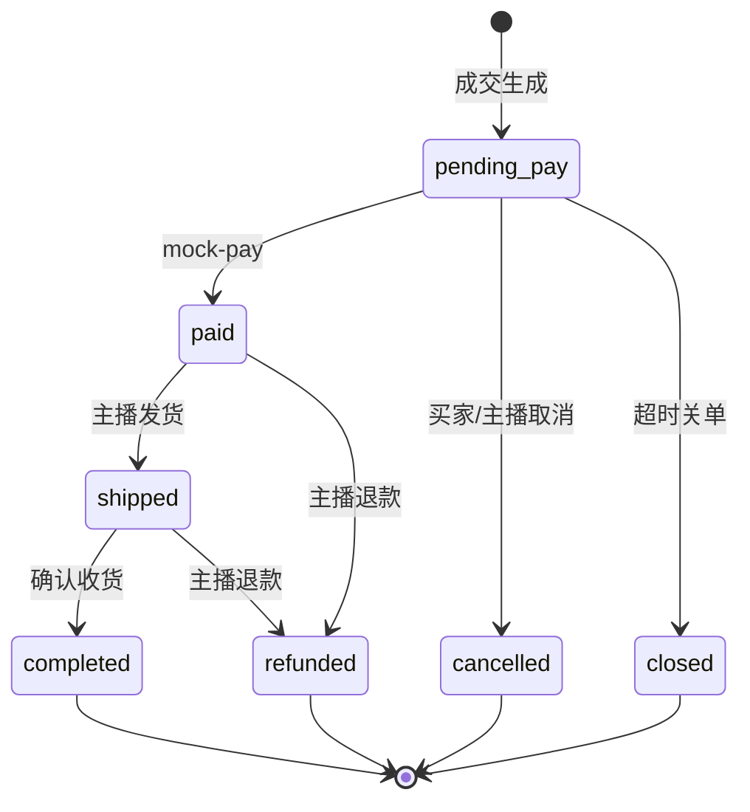

# REST API 规范（阶段 2）

统一响应：

```json
{ "code": 0, "message": "ok", "data": { } }
```

错误时 `code != 0`，HTTP 状态码与业务码对应（401/403/404/409/500）。

## 登录注册（JWT）

| 方法 | 路径 | 说明 |
|------|------|------|
| POST | `/api/v1/auth/register` | 注册（`buyer` / `anchor`） |
| POST | `/api/v1/auth/login` | 登录 |
| GET | `/api/v1/auth/me` | 当前用户（需 Bearer） |

注册/登录请求体：

```json
{
  "phone": "13800138000",
  "password": "123456",
  "nickname": "昵称",
  "role": "buyer"
}
```

登录仅需 `phone`、`password`。响应：

```json
{
  "token": "eyJhbGciOiJIUzI1NiIs...",
  "user": { "id": 1, "openId": "u_13800138000", "phone": "13800138000", "nickname": "昵称", "role": "buyer" }
}
```

鉴权：请求头 `Authorization: Bearer <token>`（有效期 7 天）。

种子演示账号（密码均为 `123456`）：

| 手机号 | 角色 |
|--------|------|
| 13800000001 | 主播 |
| 13800000002 ~ 04 | 买家 |
| 13800000005 | 管理员 |

数据库迁移：`backend/migrations/003_auth.sql`

## Mock 鉴权（开发，可选）

无 Bearer 时仍支持：

| Header | 示例 | 说明 |
|--------|------|------|
| `X-Mock-Open-Id` | `anchor_001` | 种子 openId |
| `X-User-Id` | `1` | 用户数字 ID |

管理端角色须为 `anchor` 或 `admin`。WebSocket 支持 Query `token=<JWT>`。

## 管理端 — 商品

| 方法 | 路径 | 说明 |
|------|------|------|
| POST | `/api/v1/admin/products` | 创建商品（默认 `draft`） |
| GET | `/api/v1/admin/products` | 列表，`?page=1&pageSize=20&status=draft` |
| GET | `/api/v1/admin/products/:id` | 详情 |
| PUT | `/api/v1/admin/products/:id` | 更新（`auctioning`/`sold` 不可改） |
| DELETE | `/api/v1/admin/products/:id` | 删除草稿；其余下架 |

请求体示例：

```json
{
  "name": "限定潮玩盲盒",
  "description": "直播间专拍",
  "coverUrl": "https://example.com/cover.jpg",
  "images": ["https://example.com/1.jpg"]
}
```

## 管理端 — 发布竞拍

| 方法 | 路径 | 说明 |
|------|------|------|
| POST | `/api/v1/admin/products/:id/auctions` | 发布场次（`pending`） |

请求体（金额均为**分**）：

```json
{
  "startingPrice": 0,
  "bidIncrement": 1000,
  "capPrice": 500000,
  "durationSec": 120,
  "extendThresholdSec": 10,
  "extendSec": 30,
  "scheduledStartAt": "2026-05-26T12:00:00+08:00"
}
```

- `capPrice` 可省略表示无封顶
- `extendThresholdSec` / `extendSec` 可省略，默认 10 / 30
- 同一商品仅允许一个 `pending` 或 `running` 场次

响应 `data` 为 `AuctionSession`（含 `roomId`、`rules`、`status: pending`）。

## 管理端 — 场次

| 方法 | 路径 | 说明 |
|------|------|------|
| GET | `/api/v1/admin/auctions/:sessionId` | 场次详情 |
| PUT | `/api/v1/admin/auctions/:sessionId/rules` | 修改规则（仅 `pending` 且无出价） |
| POST | `/api/v1/admin/auctions/:sessionId/cancel` | 取消场次（`pending`/`running`） |

取消请求体：

```json
{ "reason": "主播临时下架" }
```

## 管理端 — 商品列表/详情（含竞拍进度）

`GET /admin/products` 与 `GET /admin/products/:id` 的 `data` 在商品字段外增加 `auction`：

```json
{
  "id": 1,
  "name": "Vintage 机械腕表",
  "status": "listed",
  "auction": {
    "sessionId": 1,
    "roomId": "room_sess_1",
    "status": "pending",
    "currentPrice": 0,
    "bidCount": 0,
    "participantCount": 0,
    "scheduledStartAt": "2026-05-26T12:00:00+08:00",
    "order": null
  }
}
```

已成交时 `auction.status` 为 `settled`，`order` 含订单摘要。

## 管理端 — 订单

| 方法 | 路径 | 说明 |
|------|------|------|
| GET | `/api/v1/admin/orders` | 订单列表，`?page=1&status=paid` |
| GET | `/api/v1/admin/orders/:id` | 订单详情 |
| POST | `/api/v1/admin/orders/:id/ship` | 发货（`paid` → `shipped`，需买家已填地址；body 可选 `trackingNo`） |
| POST | `/api/v1/admin/orders/:id/cancel` | 取消待支付订单（`pending_pay` → `cancelled`；body: `{ "reason": "误拍协商取消" }`） |
| POST | `/api/v1/admin/orders/:id/refund` | 模拟退款（`paid`/`shipped` → `refunded`；body: `{ "reason": "缺货无法履约" }`） |

**售后状态说明**：

| 状态 | 触发方 | 前置状态 |
|------|--------|----------|
| `cancelled` | 买家 / 主播 | `pending_pay` |
| `refunded` | 主播 | `paid` / `shipped` |
| `closed` | 系统 | `pending_pay`（超时未支付） |

取消 / 退款均写入 `cancel_reason`、`cancelled_by`；退款另写 `refunded_at`。买家会收到 `order_cancelled` / `order_refunded` 站内消息。

成交后由规则引擎判定封顶/到时成交，`BidService` 在事务内落库并生成订单。

### 规则引擎（阶段 3）

| 规则 | 实现 |
|------|------|
| 0 元起拍 | `engine.EvaluateBid` + `MinNextBid` |
| 加价幅度 | 低于 `current + increment` 拒绝 |
| 封顶成交 | 达到 `capPrice` 立即 `settled`，不触发延时 |
| 自动延时 | 结束前 `extendThresholdSec` 内出价延长 `extendSec` |
| 幂等 | `requestId` + `uk_session_request` |
| 并发 | Redis `SessionLockKey` + DB `FOR UPDATE` + `version` 乐观锁 |

压测：`backend/scripts/bid_stress.sh`（需 `hey`）。

---

## 用户端 — 竞拍查询（2.7）

无需登录。

| 方法 | 路径 | 说明 |
|------|------|------|
| GET | `/api/v1/auctions` | 竞拍列表，`?status=running&page=1` |
| GET | `/api/v1/auctions/:sessionId` | 详情（含 `session`、`product`、`snapshot`） |

列表项结构：

```json
{
  "session": { "id": 1, "status": "pending", "rules": { }, "currentPrice": 0 },
  "product": { "id": 1, "name": "Vintage 机械腕表", "coverUrl": "..." }
}
```

## 用户端 — 场次快照（2.8）

服务端权威倒计时，客户端仅展示。

| 方法 | 路径 | 说明 |
|------|------|------|
| GET | `/api/v1/auctions/:sessionId/snapshot` | 按场次 ID |
| GET | `/api/v1/rooms/:roomId/snapshot` | 按房间 ID（WS `roomId`） |

```json
{
  "sessionId": 1,
  "roomId": "room_sess_1",
  "status": "running",
  "currentPrice": 15000,
  "bidCount": 3,
  "participantCount": 2,
  "minNextBid": 16000,
  "rules": { "startingPrice": 0, "bidIncrement": 1000, "durationSec": 120 },
  "endAtMs": 1716700000000,
  "remainingMs": 45000,
  "serverTimeMs": 1716699955000
}
```

## 用户端 — 出价（2.9）

需 Mock 鉴权（买家示例：`X-Mock-Open-Id: buyer_001`）。

| 方法 | 路径 | 说明 |
|------|------|------|
| POST | `/api/v1/auctions/:sessionId/bids` | 出价（REST 入口，与后续 WS 共用规则） |

请求体：

```json
{
  "amount": 10000,
  "requestId": "bid-uuid-001"
}
```

- `requestId` 幂等：重复请求返回同一笔出价
- 首场出价自动将 `pending` 开拍为 `running`，并启动倒计时
- 结束前 `extendThresholdSec` 内有出价会延时 `extendSec` 秒
- 达到 `capPrice` 立即成交并生成订单

响应含 `bid`、`session`、`snapshot`；若封顶成交则 `settled: true` 且带 `order`。

### 高并发与缓存（阶段 5）

- 快照/排行榜读路径优先 **Redis**（未连接 Redis 时直读 DB）
- 出价成功 **先写 MySQL 再写穿缓存**
- 一致性说明见 [cache-consistency.md](./cache-consistency.md)

| 方法 | 路径 | 说明 |
|------|------|------|
| GET | `/api/v1/metrics` | 出价次数、失败率、缓存命中、WS 连接数 |

压测：`backend/scripts/bid_stress.sh`（默认 `CONCURRENCY=120`），报告模板见 [load-test-report.md](./load-test-report.md)。

---

## WebSocket 实时通信（阶段 4）

完整协议见 [ws-protocol.md](./ws-protocol.md)。

| 项目 | 说明 |
|------|------|
| 端点 | `GET /api/v1/ws`（Upgrade） |
| 房间 | Query `roomId`，与场次 `roomId` 一致 |
| 鉴权 | Query `openId` / `userId`（Mock） |
| 重连 | `clientId` + `lastSeq` → `sync` 消息 |
| 出价 | WS `bid` 或 REST `POST .../bids`，共用规则引擎 |

出价成功后会向房间内广播 `bid.new`、`rank.update`；延时/成交/取消见协议文档。

---

## 用户端 — 订单与模拟支付（2.11 / 7.6）

需 Mock 鉴权（买家）。

| 方法 | 路径 | 说明 |
|------|------|------|
| GET | `/api/v1/orders` | 我的订单列表（含 `product` 摘要，避免 N+1），`?status=pending_pay` |
| GET | `/api/v1/orders/:id` | 订单详情 + 商品摘要（仅买家本人） |
| GET | `/api/v1/auctions/:sessionId/order` | 按场次查本人订单 + 商品摘要 |
| POST | `/api/v1/orders/:id/mock-pay` | 模拟支付（`pending_pay` → `paid`，超时返回 409） |
| PUT | `/api/v1/orders/:id/shipping-address` | 填写收货地址（`paid` 状态，body: `receiverName/Phone/Address`） |
| POST | `/api/v1/orders/:id/confirm-receive` | 确认收货（`shipped` → `completed`） |
| POST | `/api/v1/orders/:id/cancel` | 买家取消待支付（`pending_pay` → `cancelled`；body: `{ "reason": "误拍/拍错" }`） |

订单创建时写入 `payExpireAt`（默认创建后 30 分钟，环境变量 `PAY_TIMEOUT_MINUTES`）；超时未支付由后台任务自动 `closed`。

**履约与售后状态机**：



正常履约：`pending_pay` → `paid` → `shipped` → `completed`（主播发货见管理端）。已支付误拍 / 缺货等异常由主播在管理端发起退款（`paid`/`shipped` → `refunded`）。

历史竞拍：使用 `GET /api/v1/auctions?status=settled`（2.10 列表能力）。
