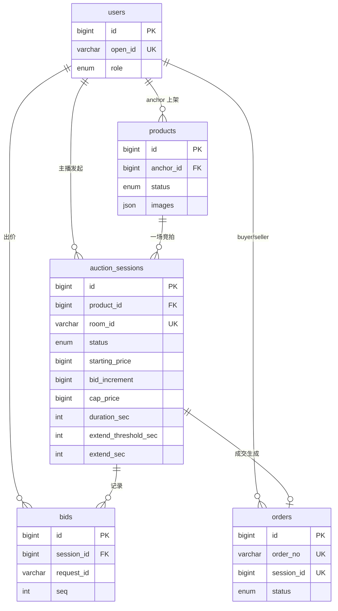
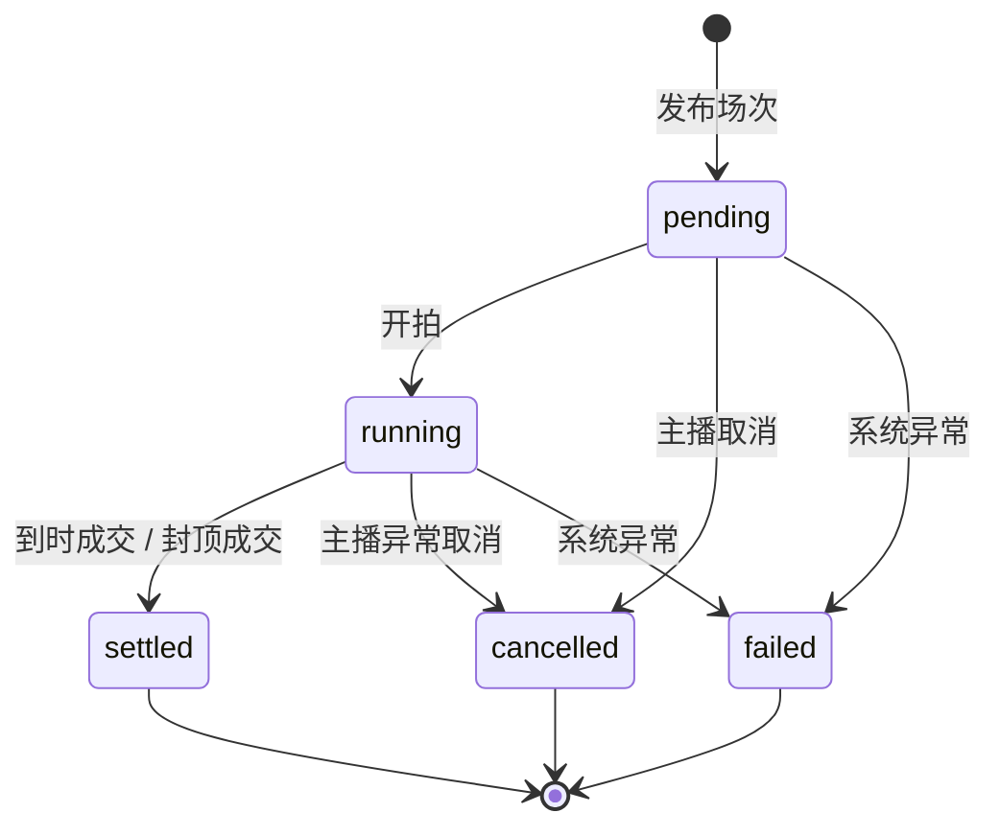
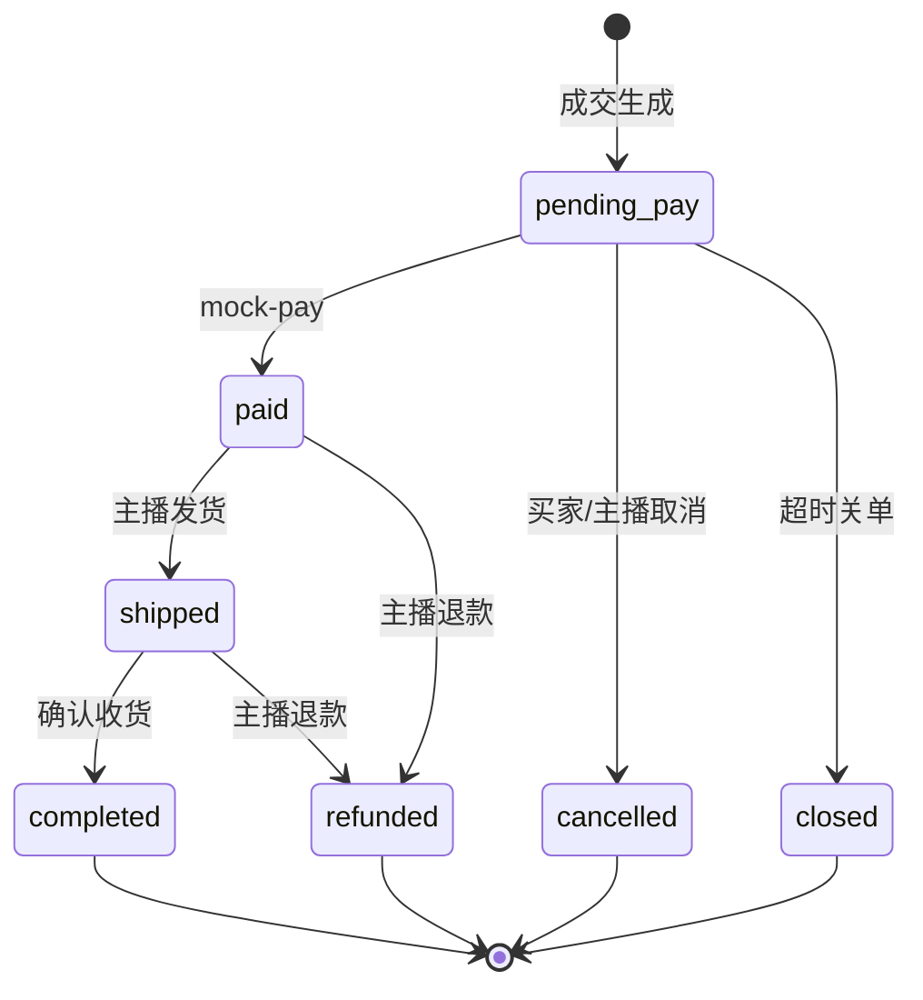

# 阶段 1：数据与领域模型

> 对应 TASKS.md 1.1 – 1.5

## 1. ER 关系图



### 实体说明

| 实体 | 说明 |
|------|------|
| `users` | 买家 / 主播 / 管理员；`open_id` 用于 Mock 登录 |
| `products` | 商品基础信息，与场次解耦，支持多场次历史 |
| `auction_sessions` | 竞拍场次 + **规则字段** + 运行时快照 |
| `bids` | 出价流水；`(session_id, request_id)` 幂等 |
| `orders` | 成交后一对一订单；Mock 支付更新 `status` |

**金额**：全部使用 `BIGINT` 存储「分」，前端展示时 `/100`。

---

## 2. 竞拍状态机



| 状态 | 含义 | 允许操作 |
|------|------|----------|
| `pending` | 未开始 | 修改规则、开拍、取消 |
| `running` | 进行中 | 出价、延时、取消、封顶成交 |
| `settled` | 已成交 | 只读；生成订单 |
| `cancelled` | 已取消 | 只读；广播取消原因 |
| `failed` | 异常 | 只读；人工/系统处理 |

Go 实现：`backend/internal/domain/session_status.go` 中 `CanTransition` / `SessionStatus` 方法。

### 2.1 订单状态机（履约 + 售后）



| 状态 | 含义 | 典型场景 |
|------|------|----------|
| `pending_pay` | 待支付 | 正常成交；30 分钟内需支付 |
| `paid` | 已支付待发货 | 买家填地址后主播可发货 |
| `shipped` | 已发货 | 买家确认收货 |
| `completed` | 已完成 | 终态 |
| `cancelled` | 已取消 | 误拍协商；仅 `pending_pay` 可取消 |
| `closed` | 超时关闭 | 系统关单 |
| `refunded` | 已退款 | 主播对已支付/已发货订单模拟退款 |

DDL 迁移：`006_order_fulfillment.sql`（履约字段）、`007_order_aftersale.sql`（售后字段）。

---

## 3. 规则字段建模

| 字段 | 类型 | 说明 |
|------|------|------|
| `starting_price` | BIGINT | 起拍价（分），**0 = 0 元起拍** |
| `bid_increment` | BIGINT | 加价幅度（分），> 0 |
| `cap_price` | BIGINT NULL | 封顶价；NULL 无封顶；达到后立即成交 |
| `duration_sec` | INT | 基础竞拍时长 |
| `extend_threshold_sec` | INT | 结束前 N 秒内有出价 → 触发延时 |
| `extend_sec` | INT | 单次延长秒数，**10–30** |

校验逻辑：`AuctionRules.Validate()`、`MinNextBid()`、`IsCapReached()`。

---

## 4. Redis Key 设计

| Key 模式 | 类型 | 用途 | TTL |
|----------|------|------|-----|
| `zhibo:room:{roomId}:snapshot` | Hash | 场次快照（价、人数、状态、endAt） | 24h |
| `zhibo:room:{roomId}:rank` | ZSET | 排行榜 TopN | 随场次 |
| `zhibo:room:{roomId}:countdown` | String | 权威结束时间 Unix 毫秒 | 24h |
| `zhibo:room:{roomId}:participants` | SET | 参与人数去重 | 24h |
| `zhibo:room:{roomId}:seq` | String | WS 事件递增序号 | 24h |
| `zhibo:lock:session:{id}` | String | 出价分布式锁 `SET NX EX` | 5s |
| `zhibo:bid:idem:{sessionId}:{requestId}` | String | 出价幂等 | 1h |
| `zhibo:session:{id}:bid_seq` | String | 场次出价序号 INCR | 24h |

常量与构造函数：`backend/internal/domain/redis_keys.go`。

MySQL 与 Redis 的读写路径、一致性策略与代码索引见 [mysql-redis.md](../mysql-redis.md)。

### snapshot Hash 建议字段

```
current_price, bid_count, participant_count, status,
end_at_ms, winner_id, session_id, version
```

---

## 5. 迁移与种子数据

```bash
# 启动 MySQL（首次启动会自动执行 migrations/*.sql）
docker compose up -d mysql

# 或手动执行
mysql -h127.0.0.1 -uzhibo -pzhibo zhibo < backend/migrations/001_schema.sql
mysql -h127.0.0.1 -uzhibo -pzhibo zhibo < backend/migrations/002_seed.sql
```

种子数据包含：1 主播、3 买家、3 商品、3 个场次（未开始 ×2、已成交样例 ×1）。

Mock 用户 `open_id`：`anchor_001`、`buyer_001` … 供后续鉴权 Mock。

---

## 6. 目录索引

```
backend/
├── migrations/
│   ├── 001_schema.sql
│   └── 002_seed.sql
└── internal/domain/
    ├── user.go
    ├── product.go
    ├── auction_rules.go
    ├── auction_session.go
    ├── session_status.go
    ├── bid.go
    ├── order.go
    ├── redis_keys.go
    └── errors.go
```
