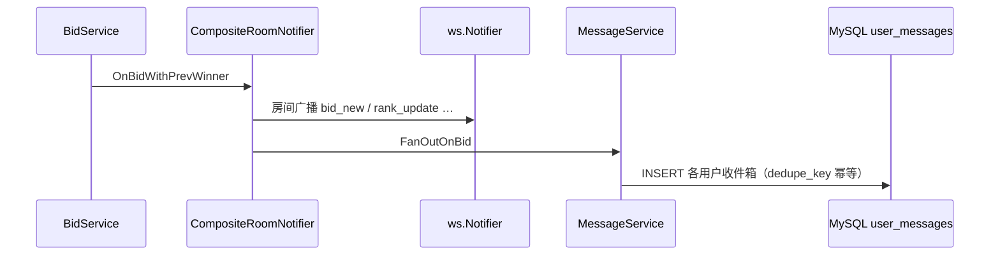

# 消息系统 — 写扩散 + Bento UI

> 对应用户端消息中心 `/app/messages`  
> 相关：[WebSocket 协议](./ws-protocol.md) · [MySQL/Redis](./mysql-redis.md)

---

## 1. 架构：写扩散（Fan-out on Write）

与直播间 **WebSocket 广播**（读时推送）互补，消息中心采用 **写扩散**：

| 模式 | 写入时机 | 读取方式 | 适用 |
|------|----------|----------|------|
| **写扩散** | 事件发生时，为每个收件人插入一行 `user_messages` | `GET /messages` 直查用户信箱 | 站内通知、历史消息 |
| **WS 广播** | 事件发生时推送到房间连接 | 客户端实时订阅 | 毫秒级直播间同步 |



### 写扩散触发规则

| 事件 | 收件人 | `event_type` | `dedupe_key` |
|------|--------|--------------|--------------|
| 领先被抢 | 原领先者 | `outbid` | `outbid:{sessionId}:{bidSeq}` |
| 竞拍延时 | 除出价者外所有参与者 | `extended` | `extended:{sessionId}:{bidSeq}` |
| 成交-中标 | 胜者 | `settled_win` | `settled_win:{sessionId}` |
| 成交-未中 | 其他参与者 | `settled` | `settled:{sessionId}:{userId}` |
| 取消场次 | 所有参与者 | `cancelled` | `cancelled:{sessionId}` |
| 订单取消 | 买家 | `order_cancelled` | `cancelled:{orderId}` |
| 订单退款 | 买家 | `order_refunded` | `refunded:{orderId}` |
| 订单发货 | 买家 | `order_shipped` | `shipped:{orderId}` |

参与者列表来自 `bids` 表 `DISTINCT user_id`；领先者快照在出价事务内 `GetWinningUserIDTx` 获取。

---

## 2. 数据模型

DDL：`backend/migrations/004_messages.sql`

```sql
user_messages (
  user_id, event_type, category, title, body,
  payload JSON, is_read, dedupe_key,
  UNIQUE (user_id, dedupe_key)
)
```

- **payload**：`sessionId`、`roomId`、`orderId`、`amount` 等上下文，供前端跳转
- **dedupe_key**：同一用户同一事件只写一条，重复出价/重试安全

---

## 3. REST API

| 方法 | 路径 | 说明 |
|------|------|------|
| GET | `/api/v1/messages` | 分页列表，`?unread=1` 仅未读 |
| GET | `/api/v1/messages/unread-count` | 未读数（Tab 角标） |
| POST | `/api/v1/messages/:id/read` | 单条已读 |
| POST | `/api/v1/messages/read-all` | 全部已读 |

均需登录（`Authorization: Bearer`）。

---

## 4. 前端 UI

| 要素 | 实现 |
|------|------|
| **Bento Grid** | `.bento-grid--messages` 双列不规则卡片（hero / wide / tall） |
| **Glassmorphism** | `.glass-panel`：`backdrop-filter` + 半透明边框与内高光 |
| **等距图标** | `IsometricIcons.tsx`：按 `event_type` 映射 IsoGavel / IsoClock / IsoTrophy 等 |

入口：个人中心「消息中心」、`/app/messages`；「我的」Tab 显示未读角标。

---

## 5. 代码索引

```
backend/
├── migrations/004_messages.sql
├── internal/domain/message.go
├── internal/repository/message_repo.go
├── internal/service/message_service.go      # 写扩散
├── internal/service/composite_notifier.go   # WS + 消息
└── internal/api/handler/message_handler.go

frontend/
├── src/api/messages.ts
├── src/user/pages/MessagesPage.tsx
├── src/components/icons/IsometricIcons.tsx
└── src/index.css                            # glass + bento 样式
```

---

## 6. 迁移

```bash
mysql -u zhibo -pzhibo zhibo < backend/migrations/004_messages.sql
```

重启后端后，在直播间参与出价即可在消息中心看到写扩散落库的通知。
