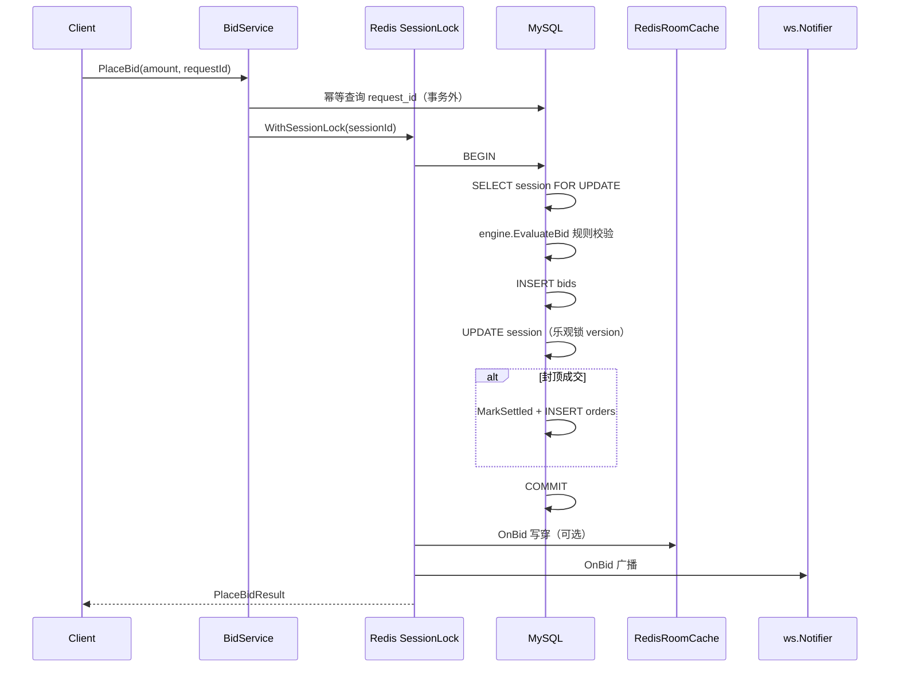

# MySQL 与 Redis 协作说明

> 对应 TASKS.md 阶段 1（数据模型）、阶段 3（规则引擎）、阶段 5（高并发与缓存）  
> 相关文档：[数据模型](./data-model/README.md) · [缓存与一致性](./cache-consistency.md) · [API 规范](./api-spec.md)

---

## 1. 设计原则

| 存储 | 角色 | 说明 |
|------|------|------|
| **MySQL** | 唯一真相源（Source of Truth） | 用户、商品、场次、出价、订单；所有业务终态以库为准 |
| **Redis** | 读优化 + 并发辅助 | 场次快照、排行榜、倒计时、分布式锁；**不可单独决定业务结果** |

**一致性模型**

- 出价路径：**Write-Through** — 先 MySQL 事务提交，再写穿 Redis，最后 WebSocket 广播
- 读快照路径：**Cache-Aside** — 优先 Redis，未命中则 `singleflight` 回源 MySQL 并回填
- 取消 / 终态：**Invalidate + Refresh** — 删除旧 Key 后按最新 DB 状态重写缓存

**降级策略**：Redis 连接失败时，服务仍可启动（见 `backend/internal/api/router.go`）：

- 分布式锁 → `NoopLocker`（仅依赖 DB `FOR UPDATE` + 乐观锁）
- 房间缓存 → `nil`，快照接口直读 MySQL

---

## 2. MySQL 职责

### 2.1 核心表

DDL：`backend/migrations/001_schema.sql`  
种子：`backend/migrations/002_seed.sql`

| 表 | 职责 |
|----|------|
| `users` | 买家 / 主播 / 管理员 |
| `products` | 商品；状态随场次变化（`listed` → `auctioning` → `sold`） |
| `auction_sessions` | 场次规则 + **运行时快照**（`current_price`、`bid_count`、`version`、`end_at` 等） |
| `bids` | 出价流水；`(session_id, request_id)` 唯一，保证幂等 |
| `orders` | 成交订单；`(session_id)` 唯一，一场一单 |

**金额**：全部 `BIGINT` 存「分」，前端展示 `/100`。

### 2.2 哪些操作只走 MySQL

| 场景 | 入口 | 说明 |
|------|------|------|
| 商品 CRUD、发布竞拍、改规则、取消 | `/api/v1/admin/*` | `ProductService` / `AuctionService` |
| 竞拍列表、详情（非快照字段） | `GET /api/v1/auctions` | `UserAuctionService.List` / `Get` |
| 订单查询、Mock 支付 | `/api/v1/orders/*` | `OrderService` |
| 登录注册 | `/api/v1/auth/*` | `AuthService` |

### 2.3 出价事务（写路径核心）

实现：`backend/internal/service/bid_service.go`



**并发与幂等**

| 机制 | 实现 | 作用 |
|------|------|------|
| 幂等键 | `bids.uk_session_request (session_id, request_id)` | 重复请求返回同一笔出价 |
| 行锁 | `SessionRepo.GetByIDForUpdate` | 同场次并发出价在事务内串行 |
| 乐观锁 | `auction_sessions.version` + `ApplyBid ... WHERE version = ?` | 防止丢失更新 |
| 分布式锁（可选） | `zhibo:lock:session:{id}` SET NX 5s | 多实例下减少争抢 |

> 说明：`domain.BidIdempotentKey` 已在 Key 设计中预留，**当前实现幂等完全依赖 MySQL 唯一索引**，未写 Redis 幂等缓存。

### 2.4 规则引擎与持久化分离

- **规则计算**：`backend/internal/engine/auction_engine.go`（纯函数，无 IO）
- **持久化**：`BidService` 在事务内调用 `SessionRepo` / `BidRepo` / `OrderRepo`

引擎负责：0 元起拍、加价幅度、封顶成交、延时窗口；MySQL 只存储计算后的终态。

---

## 3. Redis 职责

### 3.1 Key 一览

常量定义：`backend/internal/domain/redis_keys.go`  
读写封装：`backend/internal/infra/redis/`、`backend/internal/service/room_cache.go`

| Key 模式 | 类型 | 用途 | TTL |
|----------|------|------|-----|
| `zhibo:lock:session:{sessionId}` | String | 出价分布式锁 `SET NX` | 5s |
| `zhibo:room:{roomId}:snapshot` | String(JSON) | 房间场次快照 | 24h |
| `zhibo:session:{sessionId}:snapshot` | String(JSON) | 按场次 ID 快照（与上双写） | 24h |
| `zhibo:room:{roomId}:rank` | ZSET | 用户最高出价排行 | 24h |
| `zhibo:room:{roomId}:rank_top` | String(JSON) | TopN 展示（含昵称、头像） | 24h |
| `zhibo:room:{roomId}:countdown` | String | 权威结束时间 Unix 毫秒 | 24h |
| `zhibo:room:{roomId}:participants` | SET | 参与用户去重 | 24h |
| `zhibo:room:{roomId}:null` | String | 空值标记，防穿透 | 60s |
| `zhibo:room:{roomId}:seq` | INCR | WS 事件序号（重连补偿） | — |
| `zhibo:bid:idem:{sessionId}:{requestId}` | String | 幂等（**预留，未使用**） | 1h |

**ZSET 分数编码**：`score = amount * 1e6 + (1_000_000 - seq)`，价高优先，同价先出价者优先。

### 3.2 哪些操作会读写 Redis

| 场景 | 读 Redis | 写 Redis |
|------|:--------:|:--------:|
| 出价 REST / WS | 锁 | OnBid 写穿 |
| `GET .../snapshot` | 优先 | Miss 时回填 |
| WS 倒计时 tick | 可读 countdown | Hub 广播 |
| WS 排名推送 | rank_top | 失效后 DB 回填 |
| 主播取消场次 | — | Invalidate + Refresh |
| 商品列表 / 订单 | — | — |

---

## 4. 读写流程详解

### 4.1 写：出价（POST `/auctions/:id/bids` 或 WS bid）

```
1. [可选] Redis 分布式锁（sessionId）
2. MySQL 事务
     ├─ 幂等：已存在 request_id → 直接返回
     ├─ SELECT auction_sessions ... FOR UPDATE
     ├─ EvaluateBid（规则引擎）
     ├─ INSERT bids
     ├─ UPDATE auction_sessions（version 乐观锁）
     └─ 成交：UPDATE settled + INSERT orders
3. COMMIT
4. Redis OnBid
     ├─ SET snapshot（room + session 双写）
     ├─ SET countdown
     ├─ ZADD rank
     ├─ SADD participants（新用户）
     └─ DEL rank_top（使 TopN 失效）
5. WebSocket
     ├─ bid_new / rank_update / auction_extended / auction_settled
     └─ loadRankTop：Redis → Miss 则 MySQL JOIN → 回填 rank_top
```

### 4.2 读：场次快照（GET `/snapshot`）

```
1. 检查 zhibo:room:{roomId}:null → 存在则快速 404
2. GET zhibo:room:{roomId}:snapshot
     ├─ 命中 → enrichSnapshotTiming（重算 remainingMs / serverTimeMs）
     └─ 未命中 → singleflight 回源 MySQL GetByRoomID → 编码回填
3. 无 Redis 时：直接 MySQL + BuildSnapshot
```

**倒计时展示**：缓存中存 `endAtMs`，每次读出按**当前服务器时间**重算 `remainingMs`，避免 TTL 导致客户端看到过期倒计时。

### 4.3 写：取消场次

```
1. MySQL：Cancel 更新 status + cancel_reason
2. Redis：InvalidateRoom（删 snapshot / rank / countdown 等）
3. Redis：RefreshFromSession（按 DB 最新状态重写）
4. WebSocket：auction_cancelled
```

---

## 5. 一致性、击穿与穿透

| 场景 | 策略 | 代码位置 |
|------|------|----------|
| 真相源 | 始终以 MySQL 提交结果为准 | `bid_service.go` commit 后写缓存 |
| 写穿失败 | `OnBid` 错误被忽略；下次读回源修复 | 可生产环境加重试/告警 |
| 热点击穿 | `singleflight.Group` 合并回源 | `room_cache.go` `loadSnapshotByRoom` |
| 缓存穿透 | 不存在 roomId 写 `null` 60s | `MarkRoomAbsent` / `IsRoomAbsent` |
| 排行榜陈旧 | 出价删 `rank_top`；推送时 DB 重建 | `OnBid` + `notifier.loadRankTop` |

详见 [cache-consistency.md](./cache-consistency.md)。

---

## 6. 可观测

`GET /api/v1/metrics`（`backend/internal/infra/metrics/metrics.go`）

| 指标 | 含义 |
|------|------|
| `bidAttempts` / `bidSuccess` / `bidFailures` | 出价尝试与结果 |
| `cacheHits` / `cacheMisses` | 快照缓存命中 |
| `wsConnections` / `wsRooms` | WebSocket 连接与房间数 |

---

## 7. 环境配置

根目录 `.env.example`：

| 变量 | 说明 | 默认 |
|------|------|------|
| `MYSQL_DSN` | MySQL 连接串 | `zhibo:zhibo@tcp(127.0.0.1:3306)/zhibo?...` |
| `REDIS_ADDR` | Redis 地址 | `127.0.0.1:6379` |
| `REDIS_PASSWORD` | 密码 | 空 |
| `REDIS_DB` | 库号 | `0` |

```bash
docker compose up -d    # 启动 MySQL + Redis
cd backend && go run ./cmd/server
```

---

## 8. 代码索引

```
backend/
├── migrations/
│   ├── 001_schema.sql          # MySQL DDL
│   └── 002_seed.sql            # 种子数据
├── internal/
│   ├── domain/
│   │   ├── redis_keys.go       # Redis Key 常量
│   │   └── *.go                # 领域实体
│   ├── repository/             # MySQL 访问层
│   ├── engine/
│   │   └── auction_engine.go   # 规则引擎（无 IO）
│   ├── service/
│   │   ├── bid_service.go      # 出价写路径
│   │   ├── room_cache.go       # 缓存抽象 + Redis 实现
│   │   ├── user_auction_service.go  # 快照读路径
│   │   └── auction_service.go  # 取消时 Invalidate
│   ├── infra/
│   │   ├── mysql/mysql.go
│   │   └── redis/
│   │       ├── client.go       # 连接 + 分布式锁
│   │       └── room_cache.go   # Key 级读写
│   └── ws/
│       └── notifier.go         # 广播 + rank_top 回填
└── internal/api/router.go      # 依赖注入与降级
```

---

## 9. 操作对照速查

| 用户操作 | MySQL | Redis | WebSocket |
|----------|:-----:|:-----:|:---------:|
| 浏览竞拍列表 | ✓ | — | — |
| 查看快照 | ✓（回源） | ✓（优先） | ✓（订阅后推送） |
| 出价 | ✓（事务） | ✓（锁+写穿） | ✓ |
| 成交 | ✓（订单） | ✓（快照） | ✓（settled） |
| 取消竞拍 | ✓ | ✓（失效+刷新） | ✓（cancelled） |
| Mock 支付 | ✓ | — | — |

---

## 10. 延伸阅读

- [数据模型与状态机](./data-model/README.md)
- [缓存与一致性（阶段 5 摘要）](./cache-consistency.md)
- [WebSocket 协议](./ws-protocol.md)
- [压测报告](./load-test-report.md)
