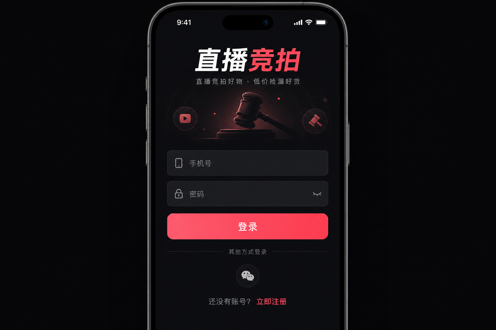
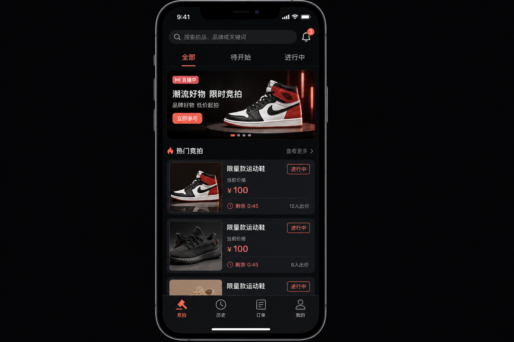
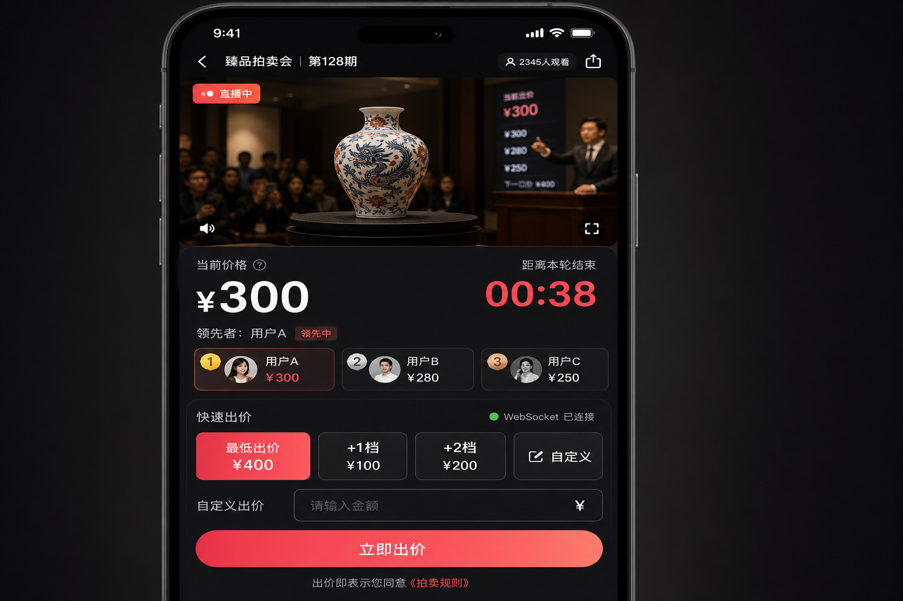
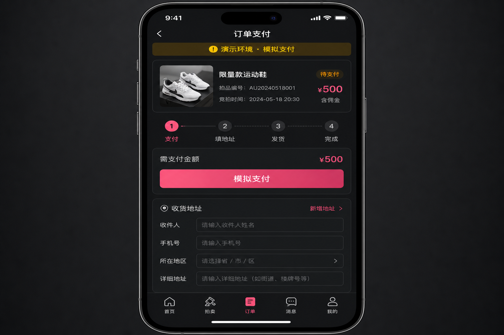

# 用户使用指南

> 直播竞拍系统 · 买家端（H5）操作说明  
> 在线体验：http://47.97.176.185/app

---

## 1. 快速开始

| 项目 | 说明 |
|------|------|
| 访问地址 | 用户端首页 `/app`，直播间 `/app/live/room_sess_1` |
| 演示账号 | 手机号 `13800000002`，密码 `123456` |
| 环境说明 | 当前为**演示环境**，支付为模拟流程，不会产生真实扣款 |

---

## 2. 注册与登录

首次使用需先登录或注册账号。

**操作步骤：**

1. 打开用户端首页，点击右上角「登录」
2. 输入手机号和密码，点击「登录」
3. 新用户可点击「立即注册」，填写手机号、昵称、密码完成注册



> **提示**：在直播间内出价时若未登录，系统会跳转到登录页；登录成功后会自动回到原直播间，保留场次信息。

---

## 3. 浏览竞拍列表

登录后进入首页「竞拍」Tab，可浏览所有场次。

**页面功能：**

| 区域 | 功能 |
|------|------|
| 搜索栏 | 按商品名称筛选 |
| 状态 Tab | 全部 / 待开始 / 进行中 |
| 排序 | 默认、价格从高到低、即将结束 |
| 场次卡片 | 展示商品图、当前价、状态、剩余倒计时 |
| 底部导航 | 竞拍 · 历史 · 订单 · 我的 |



**操作步骤：**

1. 在「进行中」Tab 查看正在竞拍的商品
2. 关注卡片上的「剩余 m:ss」倒计时，红色表示不足 1 分钟
3. 点击卡片进入详情，或点击「进入直播间」直接进入实时房间

---

## 4. 直播间出价（核心流程）

直播间是实时竞拍的主场景，价格、排名、倒计时通过 WebSocket 毫秒级同步，无需手动刷新。



### 4.1 界面说明

| 区域 | 说明 |
|------|------|
| 直播画面区 | Mock 直播氛围（演示用） |
| 价格看板 | 当前最高价、倒计时 |
| 排行榜 | 实时出价排名 |
| AI 解说条 | 可开关商品口播文案与语音播报 |
| 出价面板 | 快捷加价按钮 + 自定义金额 |

### 4.2 出价操作

1. 确认左上角连接状态为「已连接」（绿点）
2. 点击「最低出价」或「+1 档 / +2 档」快捷按钮
3. 也可在输入框填写自定义金额，点击「立即出价」
4. 出价成功后，价格和排名会实时更新

### 4.3 竞拍规则（常见）

| 规则 | 说明 |
|------|------|
| 起拍价 | 支持 0 元起拍，首笔出价即为开拍价 |
| 加价幅度 | 每次出价须 ≥ 当前价 + 加价幅度 |
| 封顶价 | 达到封顶价后**立即成交**，无需等倒计时 |
| 延时规则 | 结束前 N 秒内有人出价，倒计时自动延长 |
| 被超越提醒 | 失去领先时，面板会突出「夺回领先」按钮 |

### 4.4 成交后

- 倒计时结束或触发封顶价后，系统判定唯一胜者
- 页面展示成交结果，胜者可点击「去支付」进入订单页
- 未中拍用户可在「历史」Tab 查看本场记录

---

## 5. 订单与支付

竞拍成功后，系统自动生成订单。底部「订单」Tab 会显示待支付角标。



### 5.1 履约流程

```
成交 → 模拟支付 → 填写收货地址 → 等待主播发货 → 确认收货
```

| 步骤 | 操作 |
|------|------|
| ① 支付 | 在订单详情点击「模拟支付」（演示环境，非真实扣款） |
| ② 填地址 | 填写收货人、手机号、详细地址并保存 |
| ③ 等发货 | 主播在管理端操作发货后，订单状态变为「已发货」 |
| ④ 确认收货 | 收到商品后点击「确认收货」，订单完成 |

### 5.2 其他操作

- **取消订单**：待支付状态下可申请取消（需选择原因）
- **支付超时**：超过支付时限订单自动关闭，需重新竞拍
- **消息通知**：成交、发货等事件可在「我的 → 消息中心」查看

---

## 6. 个人中心

路径：底部 Tab「我的」

| 功能 | 说明 |
|------|------|
| 个人信息 | 查看昵称、手机号 |
| 消息中心 | 竞拍结果、物流等系统通知 |
| 历史记录 | 参与过的竞拍场次 |
| 退出登录 | 清除本地登录态 |

---

## 7. 常见问题

**Q：出价后价格没变化？**  
检查 WebSocket 连接状态；若显示「重连中」，稍等片刻或刷新页面重新进入直播间。

**Q：提示「出价过低」？**  
当前价已更新，请使用面板推荐的「最低出价」金额。

**Q：登录后回到了首页而不是直播间？**  
请从竞拍列表重新进入；正常情况下登录会保留 `?session=` 参数并自动回跳。

**Q：支付会扣真钱吗？**  
不会。页面有「演示环境 · 模拟支付」提示，仅用于流程演示。

---

## 8. 相关链接

| 入口 | 地址 |
|------|------|
| 用户端首页 | http://47.97.176.185/app |
| 默认直播间 | http://47.97.176.185/app/live/room_sess_1 |
| 主播管理端 | http://47.97.176.185/admin |
| API 文档 | [api-spec.md](./api-spec.md) |
| WebSocket 协议 | [ws-protocol.md](./ws-protocol.md) |
