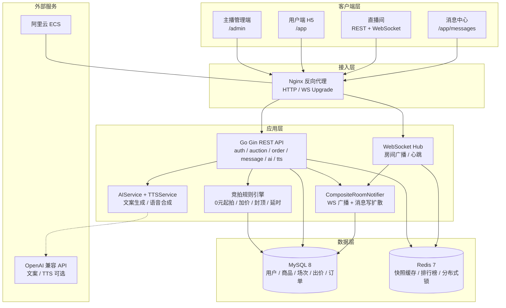
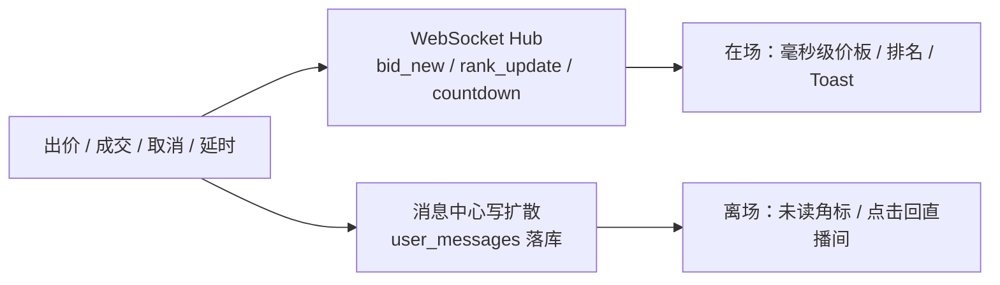
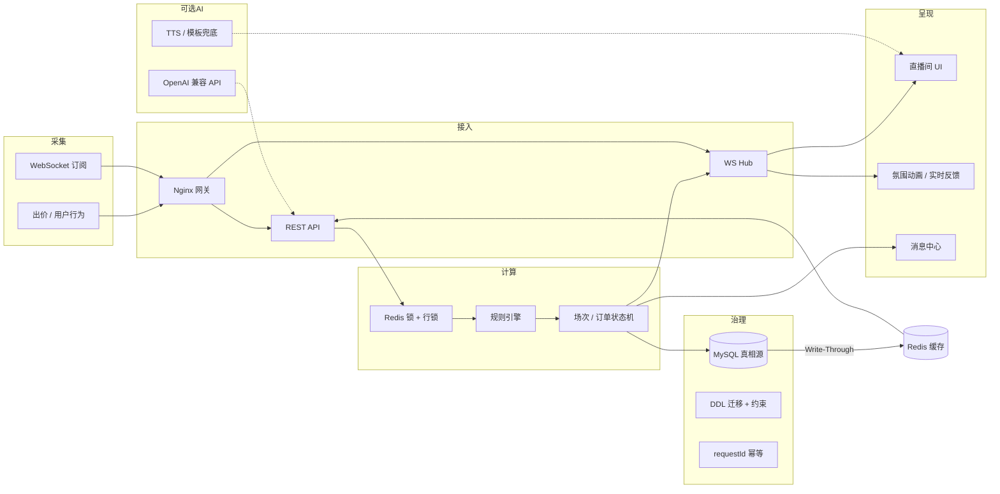
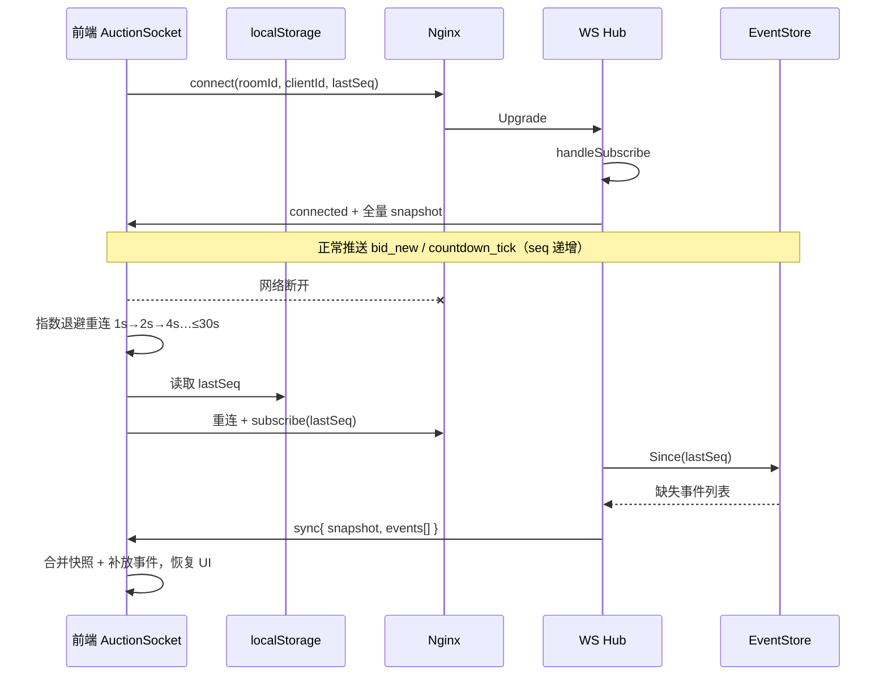
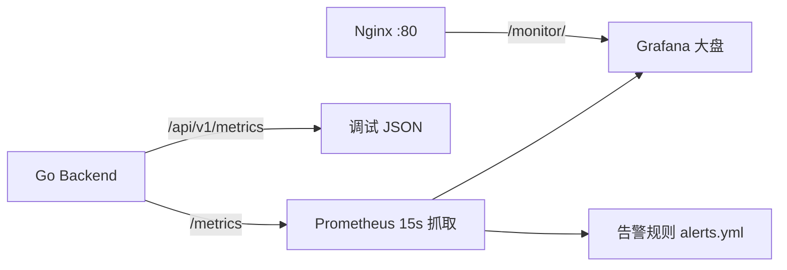

# 第二组-【请填写姓名】-训练营结项文档

> 飞书标题建议：`第二组-{你的姓名}-训练营结项文档`  
> 文档生成日期：2026-06-10

---

## 1. 课题名称

**抖音电商 AI 全栈课题 — 直播竞拍全栈系统**

与课题宣讲版及最终提交页保持一致，便于评委快速识别：**电商直播场景 + 竞拍规则引擎 + 全栈工程交付 + AI 产品介绍**。

---

## 2. 团队名称与成员名单

**团队名称**：第二组 · 【请填写队名】

| 姓名 | 学校 | 专业 | 角色 |
|------|------|------|------|
| 【请填写】 | 【请填写】 | 【请填写】 | 队长 / 后端 |
| 【请填写】 | 【请填写】 | 【请填写】 | 后端 |
| 【请填写】 | 【请填写】 | 【请填写】 | 前端 |

> 若为单人完成，保留一行并注明「独立完成」即可。  
> 仓库提交者：`zhangdingyi05`（GitHub：`zhangdingyi123/zhibo-master`）。

---

## 3. 分工说明

| 成员 | 负责模块 | 主要产出 |
|------|----------|----------|
| 【后端 A】 | 规则引擎、竞拍状态机、订单、MySQL 数据模型 | `backend/internal/engine/`、`order_service.go`、DDL 迁移 |
| 【后端 B】 | WebSocket 实时推送、Redis 缓存与分布式锁、压测与可观测 | `backend/internal/ws/`、`room_cache.go`、`bid_stress.sh` |
| 【前端】 | 主播管理端、用户端 H5、直播间 WS 客户端、消息中心 UI | `frontend/src/admin/`、`frontend/src/user/` |
| 【全员】 | 联调验收、阿里云部署、演示录屏、结项材料 | `docs/`、`scripts/manual-deploy.sh` |

---

## 4. 核心功能清单

1. **主播端商品与竞拍管理**：商品 CRUD、发布竞拍（起拍价 / 加价幅度 / 封顶 / 时长 / 延时）、规则修改、异常取消、订单查询与售后。
2. **竞拍规则引擎**：0 元起拍、加价幅度校验、封顶立即成交、结束前 N 秒出价自动延时、出价幂等（`requestId`）与唯一胜者判定。
3. **用户端直播间实时体验**：WebSocket 推送当前价、倒计时、排名；REST 出价；多浏览器同房间状态同步；Mock 直播画面 + 弹幕 / 点赞营造在场感。
4. **高并发出价防乱价**：Redis 分布式锁 + MySQL 行锁与乐观锁双层保护，120 并发压测 0 次 5xx，DB 最终价一致。
5. **成交订单与履约闭环**：场次成交自动生成订单，支持待支付超时关单、模拟支付、填写收货地址、主播发货与用户确认收货。
6. **AI 产品介绍**：管理端一键生成直播口播稿；用户端直播间解说条轮播 + TTS 语音解说（云端 / 浏览器双通道兜底）。

---

## 5. 端到端使用流程

1. 主播使用手机号登录管理端（`/admin`），创建商品并配置竞拍规则（起拍价、加价幅度、封顶、时长、延时）。
2. 买家在用户端（`/app`）注册 / 登录后进入竞拍列表，点击进入直播间，通过 WebSocket 订阅房间实时数据。
3. 买家提交出价，后端规则引擎校验通过后更新价格，并向全房间广播最新快照、排名与倒计时。
4. 若结束前仍有新出价则自动延时；若达到封顶价则立即成交，竞拍结束后为胜者生成订单。
5. 买家在「我的订单」完成 Mock 支付并填写收货地址；主播发货后买家确认收货，订单完成。
6. 异常场景（误拍取消、主播退款）通过售后流处理，相关通知同步写入消息中心（`/app/messages`）。

---

## 6. 在线 Demo 链接

| 端 | 链接 | 说明 |
|----|------|------|
| 用户端 | http://47.97.176.185/app | 竞拍列表、登录注册 |
| 直播间 | http://47.97.176.185/app/live/room_sess_1 | 实时出价演示 |
| 主播端 | http://47.97.176.185/admin | 商品与场次管理 |
| API 健康检查 | http://47.97.176.185/api/v1/health | 服务存活探测 |
| 可观测指标 | http://47.97.176.185/api/v1/metrics | 出价 / 缓存 / WS 指标 |

**体验账号**（密码均为 `123456`）：

| 角色 | 手机号 |
|------|--------|
| 主播 | `13800000001` |
| 买家 | `13800000002` |

> 部署环境：阿里云 ECS `47.97.176.185`（2C4G），Docker Compose 单机栈。域名因 ICP 备案未完成，采用 IP 直访；详见 `docs/icp-filing.md`。

---

## 7. 演示视频链接

| 项 | 内容 |
|----|------|
| 视频链接 | 【待上传：飞书附件 / B 站 / 飞书妙记 公开链接】 |
| 建议时长 | ≤ 3 分钟（可适当加速） |
| 建议内容 | ① 主播发布竞拍 → ② 用户进房出价与 WS 同步 → ③ 延时 / 封顶场景 → ④ 成交订单与支付 → ⑤ AI 解说演示 |

> 若暂未录制，可将录屏文件直接拖入飞书文档「附件区」（见文末）。

---

## 8. 源代码仓库链接

| 项 | 内容 |
|----|------|
| 主仓库 | https://github.com/zhangdingyi123/zhibo-master |
| 默认分支 | `main` |
| 最后提交 | `b334e189` — `技术债`（2026-06-10 13:28:14 +0800） |
| 技术栈 | Go 1.22+ / Gin + React 19 / TypeScript / Vite + MySQL 8 + Redis 7 |

**目录说明**：`backend/` 后端 API · `frontend/` 前端应用 · `docs/` 设计与部署文档 · `scripts/` 部署与压测脚本。

---

## 9. README / 运行说明

### 9.1 项目简介

Go 后端 + React 前端 monorepo，实现直播场景下的竞拍全栈系统，覆盖管理端、用户端、WebSocket 实时通信、规则引擎、订单与消息中心。任务清单见根目录 `TASKS.md`。

### 9.2 依赖环境

| 依赖 | 版本要求 |
|------|----------|
| Go | 1.22+ |
| Node.js | 18+（推荐 LTS） |
| Docker / Docker Compose | 用于 MySQL 8 + Redis 7 |
| hey（压测可选） | `go install github.com/rakyll/hey@latest` |

### 9.3 本地启动步骤

```bash
# 1. 基础设施
docker compose up -d

# 2. 后端（项目根目录）
cp .env.example .env    # 可选
cd backend && go run ./cmd/server
# 默认 http://localhost:8081 ，健康检查 GET /api/v1/health

# 3. 前端
cd frontend && npm install && npm run dev
# 浏览器打开 http://localhost:5173
```

演示账号：主播 `13800000001` / 买家 `13800000002`，密码 `123456`。

### 9.4 目录结构

```
zhibo-master/
├── backend/              # Go API（api / service / domain / infra / ws / engine）
│   ├── cmd/server/       # 入口
│   ├── internal/         # 业务逻辑
│   └── migrations/       # DDL 与种子数据
├── frontend/             # React 应用（admin / user / components）
├── docs/                 # 架构、API、部署、压测文档
├── scripts/              # manual-deploy.sh、压测脚本等
├── docker-compose.yml    # 本地 MySQL + Redis
└── docker-compose.prod.yml  # 生产编排
```

### 9.5 配置说明

复制 `.env.example` 为 `.env`，主要变量：

| 变量 | 说明 | 默认值 |
|------|------|--------|
| `PORT` | 后端端口 | `8081` |
| `MYSQL_DSN` | MySQL 连接串 | `zhibo:zhibo@tcp(localhost:3306)/zhibo?...` |
| `REDIS_ADDR` | Redis 地址 | `localhost:6379` |
| `JWT_SECRET` | JWT 签名密钥 | 开发默认值（生产务必修改） |
| `FRONTEND_URL` | CORS 允许来源 | `http://localhost:5173` |
| `AI_API_KEY` | 大模型 API Key（可选） | 空则降级模板文案 |
| `PAY_TIMEOUT_MINUTES` | 待支付关单时间 | `30` |

生产部署详见 `docs/deploy-aliyun.md`，一键脚本：`./scripts/manual-deploy.sh`。

---

## 10. 系统架构图



**调用关系摘要**：

- **写路径（出价）**：客户端 → Nginx → API → Redis 锁 → MySQL 事务 → 写穿 Redis → WS 广播 + 消息落库
- **读路径（快照）**：客户端 → Nginx → API → Redis 缓存 → Miss 时 singleflight 回源 MySQL
- **实时路径**：直播间 WS 长连接 → Hub 按 `roomId` 广播 `bid_new` / `rank_update` / `countdown` 等事件
- **AI 路径**：管理端生成介绍 → `AIService` 调 LLM（或模板降级）→ 用户端 `AICommentaryBar` + TTS

---

## 11. 大模型 / AI 能力使用说明

> 本课题为 **「AI 全栈」工程实践**：研发阶段以 Cursor Agent 提效；**运行时接入「AI 产品介绍」单点能力**，不参与出价与订单等确定性逻辑。

### 11.1 运行时 AI

| 能力 | 接口 / 组件 | 说明 |
|------|-------------|------|
| **卖点文案生成** | `POST /api/v1/admin/products/ai-intro` | 主播输入商品名与关键词，大模型生成直播口播稿；未配置 `AI_API_KEY` 时降级为模板文案 |
| **直播间解说条** | `AICommentaryBar` | 将 `products.description` 按句轮播，叠加在直播画面区 |
| **实时 TTS 语音** | `POST /api/v1/tts` + 浏览器 SpeechSynthesis 兜底 | 优先云端 TTS（OpenAI 兼容）；失败或未配置时自动用浏览器中文语音 |

**人工把关**：文案生成后主播可编辑再保存；竞拍规则、出价、成交仍由 `auction_engine` 严格执行。

**演示路径**：管理端「✨ AI 生成介绍」→ 保存商品 → 用户端进房 → 开启「解说开」→ 画面底部解说条 + 语音播报。

### 11.2 研发阶段 AI 工具

| 工具 | 用途 |
|------|------|
| **Cursor Agent** | 代码生成、重构、联调排错、文档撰写 |
| **Claude / GPT 系列** | 架构方案草稿、单元测试补全、压测脚本 |

### 11.3 未使用的 AI 组件（如实说明）

- ❌ RAG / 向量数据库
- ❌ 通用对话 Agent / 在线 Prompt 编排平台
- ❌ AI 参与出价、定价或订单决策

---

## 12. 关键工程难点与解决方案

### 难点 1：高并发出价防乱价

**问题**：单房间 100+ 用户同时出价，若仅依赖应用层校验，可能出现超卖、价格回退或重复扣款。

**方案**：

1. **Redis 分布式锁**（场次粒度）串行化同一房间的出价请求；
2. **MySQL 事务**内 `SELECT ... FOR UPDATE` + `version` 乐观锁，保证单行快照原子更新；
3. **`requestId` 幂等**：`(session_id, request_id)` 唯一索引，重复请求直接返回原结果。

**验证**：120 并发外网压测，仅 1 笔有效出价，119 笔 409 冲突（预期），**5xx = 0**，压测后 `currentPrice` 与 DB 一致。

### 难点 2：毫秒级实时同步与读性能

**问题**：直播间需同步价格、倒计时、排名；高频读快照不能每次打穿 MySQL。

**方案**：

1. **WebSocket Hub** 按 `roomId` 广播结构化事件（`bid_new`、`rank_update`、`countdown_tick`）；
2. **Redis 快照缓存** + `singleflight` 防缓存击穿；倒计时在读出时按 `serverTimeMs` 重算；
3. **CompositeRoomNotifier**：出价成功后同时触发 WS 广播与站内消息写扩散。

**验证**：快照读压 5000 次 / 100 并发，RPS 98.9，P50 146ms，失败 0。

### 难点 3：生产部署与域名备案阻塞

**问题**：GoDaddy 注册域名不在工信部批复名单，无法完成 ICP 备案，公网域名访问被拦截。

**方案**：

1. 阿里云 ECS + `docker-compose.prod.yml` 一键部署全栈（MySQL / Redis / Nginx / 前后端）；
2. 采用 **公网 IP 直访** `http://47.97.176.185` 保障答辩演示；
3. 文档化备案路径与 HTTPS 后续方案（`docs/icp-filing.md`、`docs/deploy-aliyun.md`）。

---

## 13. 项目亮点 / 创新点

### 亮点 1：规则引擎 + 双层锁 —— 竞拍逻辑可验证、可压测

**痛点**：直播竞拍不是普通 CRUD。0 元起拍、加价幅度、封顶立即成交、结束前 N 秒自动延时（防狙击）、异常取消等规则交织在一起，若散落在 Controller / Service 各处，极易出现边界漏洞（如封顶后仍延时、价已被超越却成交）。

**做法**：将业务规则从持久化逻辑中剥离为纯函数引擎 `auction_engine`，输入场次快照 + 出价金额，输出结构化决策（接受 / 拒绝 / 延时 / 成交）。`BidService` 仅在 MySQL 事务内执行引擎结论，保证「规则判断」与「资金落库」原子一致。并发层叠加 **Redis 场次锁 + MySQL 行锁 / 乐观锁 + `requestId` 幂等** 三层防护。

**可验证性**：引擎单测覆盖 10+ 场景（0 元起拍首笔、加价边界、封顶成交、延时窗口内外、场次不可出价等）；外网 120 并发压测 **5xx = 0、终价唯一、bid_count = 1**，证明规则 + 并发组合经得起真实流量而非 Demo 级堆砌。

| 规则 | 引擎行为 | 测试 |
|------|----------|------|
| 0 元起拍 | 首笔任意正金额开拍，`pending → running` | `TestEvaluateBid_ZeroStartingPrice` |
| 加价幅度 | 低于 `current + increment` 拒绝 | `TestEvaluateBid_IncrementBoundary` |
| 封顶成交 | 达到封顶立即 `settled`，不再延时 | `TestEvaluateBid_CapSettlesWithoutExtend` |
| 自动延时 | 结束前 N 秒内出价，`endAt` 顺延 | `TestEvaluateBid_ExtendOnRunningBid` |
| 幂等重试 | 同 `requestId` 返回原结果，不重复扣款 | `idempotent_test.go` + DB 唯一索引 |

---

### 亮点 2：MySQL 真相源 + Redis 读优化 —— 资金一致性与高并发兼得

**痛点**：直播场景读多写少，全打 MySQL 扛不住；但若把 Redis 当「真相源」，缓存与 DB 不一致会导致页面价格错乱——电商资金场景不可接受。

**做法**：明确 **MySQL 为唯一真相源**，Redis 只做读加速与推送辅助，读写策略分离：

| 路径 | 策略 | 要点 |
|------|------|------|
| **写出价** | Write-Through | 先事务提交，再写穿快照 / 排行榜 ZSET |
| **读快照** | Cache-Aside | 优先 Redis；Miss 时 `singleflight` 合并回源，防击穿 |
| **防穿透** | Null 标记 | 不存在 `roomId` 缓存 60s 快速 404 |
| **倒计时** | 读出重算 | 按 `serverTimeMs` 现场计算 `remainingMs`，避免展示过期 |
| **故障降级** | 自动切换 | Redis 不可用 → `NoopLocker` + 直读 MySQL，服务不中断 |

**可验证性**：5000 次快照读压测 P50 **146ms**、`cacheHits` 显著；120 并发出价后 DB 终价与页面一致。既满足单房间 100+ 并发，又避免「缓存即真相」的资金风险。

---

### 亮点 3：「在场 + 离场」双通道 —— 直播感与可追溯并行

**痛点**：纯 WebSocket 推送用户离场即失联；纯消息列表又缺少直播间的即时氛围。真实直播带货需要「当下刺激感」与「事后可回看」同时成立。

**做法**：将 **实时通道** 与 **持久通道** 分层设计，通过 `CompositeRoomNotifier` 在一次业务事件后同时触发两侧：



**在场体验（前端）**：无需真实推流，用 `LiveVideo`（Ken Burns 缩放 + 扫描线）、`LiveDanmaku` 弹幕、`LiveReactions` 点赞、`AICommentaryBar` 解说条营造抖音式直播氛围；真实竞拍数据（价格 / 倒计时 / 排名）走 WS，Mock 氛围与资金逻辑严格分层，互不污染。

**离场追溯（后端）**：被超越、竞拍延时、成交、取消、售后等事件写入 `user_messages`，用户关闭直播间后仍可在 `/app/messages` 查看并一键跳回。断网重连时 `EventStore` + `lastSeq` 增量补偿，保证回到房间后状态与全房一致。

---

### 亮点 4：AI 精准嵌入 —— 增强带货感，不干扰资金确定性

**痛点**：「AI 全栈」课题容易做成「什么都让模型决定」，但出价 / 成交必须 100% 确定性。

**做法**：运行时 AI 仅接入 **商品介绍生成 + 直播间解说条 + TTS** 单点能力，与 `auction_engine`、订单状态机严格隔离。未配置 `AI_API_KEY` 或 API 超时 → 模板文案；TTS 失败 → 浏览器 `SpeechSynthesis`。主播可在管理端编辑 AI 文案后再发布，**人工把关 + 机器提效**。

---

### 亮点对照（评委速览）

| 维度 | 常见 Demo | 本项目 |
|------|-----------|--------|
| 竞拍规则 | 表单字段 + if-else | 独立引擎 + 10+ 单测 + 压测佐证 |
| 缓存 | Redis 直读直写 | MySQL 真相源 + Write-Through / Cache-Aside + 降级 |
| 实时通知 | 仅 WS 或仅站内信 | 双通道：在场 WS + 离场消息落库 |
| AI | 参与核心业务 | 单点带货文案，资金路径零 AI 介入 |

---

## 14. 其余材料（可选择性填写）

### 14.1 性能指标 / 压测结果

| 场景 | 指标 | 结论 |
|------|------|------|
| 并发出价（120 并发，外网 → ECS） | RPS **195.1**，P50/P99 **460 / 577 ms**，5xx **0** | 满足单房间 100+ 并发目标 |
| 快照读（5000 次，100 并发） | RPS **98.9**，P50 **146 ms**，失败 **0** | 缓存有效，`cacheHits=288` |
| 业务一致性 | 压测后 `currentPrice=10000`、`bidCount=1` | 仅 1 笔有效出价 |
| 月成本 | ECS 约 50–100 元 | 无运行时模型 API 费用（未配置 Key 时） |

完整报告：`docs/load-test-report.md`

### 14.2 Prompt 策略 / Agent 流程

**运行时 Prompt（商品介绍生成，见 `ai_service.go`）**：

```
你是抖音电商直播带货文案助手。根据商品信息生成直播口播介绍。

商品名称：{name}
补充关键词：{keywords}

要求：
1. 150–220 字，口语化、有直播感
2. 自然融入 2–3 个卖点
3. 结尾有一句催拍 / 限时竞拍话术
4. 只输出正文，不要标题、编号或 Markdown
```

**失败兜底**：未配置 `AI_API_KEY` 或 LLM 调用失败 → 返回模板文案；TTS 失败 → 浏览器 `SpeechSynthesis` 中文语音。

**研发阶段 Cursor Agent 提示模式**：

```
上下文：给出 TASKS.md 阶段 X 要求 + 相关 domain 文件
任务：实现 {接口/组件}，遵循现有分层与错误码规范
约束：必须包含单元测试；不得破坏乐观锁事务边界
输出：代码 diff + 简要说明数据流
```

### 14.3 评测方案与样例结果

| 评测项 | 方法 | 样例 |
|--------|------|------|
| 规则正确性 | `backend/internal/engine/*_test.go` 单元测试 | 0 元起拍首笔、封顶立即成交、延时窗口 |
| 并发一致性 | `bid_stress.sh` 120 并发 + 查 DB | 终价唯一、bid_count 正确 |
| 端到端 | 双浏览器同房间 + 断网重连走查 | 价格 / 倒计时一致、出价不重复 |
| API 契约 | 对照 `docs/api-spec.md` | 管理端 / 用户端 / WS 协议 |

### 14.4 用户反馈 / 内测记录

| 来源 | 反馈摘要 |
|------|----------|
| 【待填写】 | 联调期间多浏览器同房间价格同步正常 |
| 【待填写】 | 压测后数据与页面展示一致 |
| 【待填写】 | 消息中心被超越通知可点击跳转直播间 |

---

## 附件区（飞书内直接贴文件）

> 在飞书文档中点击 **「+」→「本地文件」** 或拖拽上传，无需外链。

| 建议附件 | 本地路径 |
|----------|----------|
| 演示视频（≤3min） | 自行录制后上传 |
| 压测报告 | `docs/load-test-report.md` |
| 部署文档 | `docs/deploy-aliyun.md` |
| 代码压缩包 | 打包 `zhibo-master/` 为 `.zip` |
| 本结项文档 | `docs/第二组-训练营结项文档.md` |

---

## 参考文档索引

| 文档 | 路径 |
|------|------|
| 任务清单 | `TASKS.md` |
| API 规范 | `docs/api-spec.md` |
| WebSocket 协议 | `docs/ws-protocol.md` |
| 数据模型 | `docs/data-model/README.md` |
| MySQL / Redis 协作 | `docs/mysql-redis.md` |
| 缓存一致性 | `docs/cache-consistency.md` |
| 消息系统 | `docs/message-system.md` |
| 直播推流扩展 | `docs/streaming.md` |
| 扩展方案 | `docs/scaling.md` |
| 周报 | `docs/weekly-report-2026-06-05.md` |

---

## 附：提交页 §8 技术说明及创新亮点

> 以下内容可直接复制至最终提交页「8. 技术说明及创新亮点」栏目。

### 8.1 技术说明

#### 整体架构

系统采用 **Go + React monorepo** 全栈架构，按 `api / service / domain / infra` 分层，部署于阿里云 ECS（2C4G），通过 Docker Compose 编排 MySQL 8、Redis 7、Nginx 与前后端服务。客户端分主播管理端（`/admin`）与用户 H5 端（`/app`），经 Nginx 统一接入 REST API 与 WebSocket 长连接。

```
客户端（Admin / App）
    ↓ HTTP / WS
Nginx 反向代理
    ↓
Go Gin 应用层（规则引擎 / 出价服务 / 订单 / 消息 / AI）
    ↓                    ↓
MySQL（真相源）      Redis（缓存 / 锁 / 排行榜）
    ↓
WebSocket Hub → 房间广播 + 站内消息写扩散
```

#### 技术栈选型

| 层级 | 技术 | 选型理由 |
|------|------|----------|
| 后端 | Go 1.22 + Gin | 高并发友好、编译部署简单，适合竞拍写路径 |
| 前端 | React 19 + TypeScript + Vite | 组件化开发，管理端与用户端同仓复用 |
| 数据库 | MySQL 8 | 事务 + 行锁保障出价原子性，金额 `BIGINT` 分单位 |
| 缓存 | Redis 7 | 快照读优化、ZSET 排行榜、场次级分布式锁 |
| 实时 | 自研 WebSocket Hub | 按 `roomId` 广播结构化事件，低延迟同步 |
| AI | OpenAI 兼容 API | 商品口播稿生成 + TTS，未配置时模板 / 浏览器兜底 |

#### 核心模块说明

**1. 竞拍规则引擎（`auction_engine`）**

将业务规则从 CRUD 中剥离为纯函数引擎，集中处理：

- 0 元起拍首笔校验、最小加价幅度
- 封顶价立即成交
- 结束前 N 秒出价自动延时（防狙击）
- 场次状态机：`pending` → `running` → `settled` / `cancelled`

引擎输出结构化决策（接受 / 拒绝 / 延时 / 成交），由 `BidService` 在 MySQL 事务内执行，保证规则与持久化一致。

**2. 高并发出价链路**

出价写路径采用 **三层防护**：

1. **幂等**：`(session_id, request_id)` 唯一索引，重复请求返回原结果
2. **Redis 分布式锁**：场次粒度串行化，避免同房间并发写冲突
3. **MySQL 事务**：`SELECT ... FOR UPDATE` + `version` 乐观锁，单行快照原子更新

事务提交后 **Write-Through** 写穿 Redis 快照与排行榜，再通过 `CompositeRoomNotifier` 同时触发 WS 广播与站内消息落库。

**3. 读路径与缓存一致性**

- **Cache-Aside**：快照优先读 Redis，Miss 时 `singleflight` 合并回源 MySQL
- **倒计时重算**：读出时按 `serverTimeMs` 重算 `remainingMs`，避免展示过期
- **降级**：Redis 不可用时自动切换 `NoopLocker` + 直读 MySQL，服务不中断

**4. 实时通信与消息系统**

- WebSocket 推送 `bid_new`、`rank_update`、`countdown_tick`、`auction_extended` 等事件
- 站内消息采用 **写扩散**：被超越、延时、成交、取消、售后等事件落库 `user_messages`，用户离场后可追溯
- 前端 Bento 卡片式消息 UI，支持未读角标与一键回直播间

**5. AI 产品介绍（运行时单点能力）**

- 管理端：`POST /api/v1/admin/products/ai-intro` 生成直播口播稿，主播可编辑后保存
- 用户端：`AICommentaryBar` 轮播解说 + TTS 语音播报
- **确定性边界**：AI 不参与出价、定价、订单决策；未配置 Key 时降级模板文案

#### 工程验证数据

| 场景 | 指标 | 结论 |
|------|------|------|
| 并发出价（120 并发，外网 → ECS） | RPS 195.1，P50/P99 460/577 ms，5xx = 0 | 满足单房间 100+ 并发 |
| 快照读（5000 次，100 并发） | RPS 98.9，P50 146 ms，失败 0 | 缓存有效 |
| 业务一致性 | 压测后仅 1 笔有效出价，DB 终价唯一 | 防乱价验证通过 |

---

### 8.2 创新亮点

（与 §13 一致，可直接复制。）

1. **规则引擎 + 双层锁**：`auction_engine` 纯函数决策 + 10+ 单测；Redis 锁 + MySQL 行锁 / 乐观锁 + 幂等；120 并发压测 5xx=0、终价唯一。
2. **MySQL 真相源 + Redis 读优化**：Write-Through 出价、Cache-Aside + singleflight 读快照、击穿 / 穿透兜底；Redis 故障自动降级纯 DB。
3. **「在场 + 离场」双通道**：WS 毫秒级同步 + `CompositeRoomNotifier` 消息写扩散；Mock 直播氛围与真实资金数据分层。
4. **AI 精准嵌入**：文案 / 解说 / TTS 单点能力，不参与出价与订单；多级兜底保证演示稳定。

---

## 提交前待补全清单

| 序号 | 占位项 | 说明 |
|:----:|--------|------|
| 标题 | `【请填写姓名】` | 飞书文档标题中的队长 / 提交人姓名 |
| §2 | 队名、成员学校 / 专业 | 按实际团队填写；单人则删多余行 |
| §7 | 演示视频公开链接 | 建议 ≤3 分钟，覆盖核心场景 |
| §14.4 | 内测反馈 | 联调 / 答辩彩排中的真实反馈 |

*补全上述占位项后，复制至飞书文档并上传附件即可提交。*

---

## 15. 技术实现与工程完整度（评委评阅）

> 对应训练营评分维度：**完整工程链路闭环** + **可用性 / 性能 / 稳定性 / 可观测性**。

### 15.1 完整工程链路闭环



| 链路环节 | 实现要点 | 代码 / 文档索引 |
|----------|----------|-----------------|
| **竞拍数据采集** | 出价流水落库 `bids`（金额、seq、`request_id`）；场次快照字段 `current_price` / `bid_count` / `participant_count`；WS 推送 `bid_new` / `rank_update` / `countdown_tick` | `bid_service.go`、`bids` 表、`docs/ws-protocol.md` |
| **用户行为数据** | 参与人数统计、排行榜 ZSET；Mock 弹幕 / 点赞营造在场感（与真实出价数据分层，不污染资金逻辑） | `LiveDanmaku`、`LiveReactions`、`room_cache.go` |
| **数据治理** | MySQL 为唯一真相源；金额 `BIGINT` 分单位；`(session_id, request_id)` 唯一索引防重复扣款；`migrations/` 版本化 DDL；非法状态迁移统一 `ErrInvalidStateTransition` | `docs/data-model/`、`session_status.go` |
| **开源模型调用（可选）** | `AIService` 调 OpenAI 兼容 API 生成口播稿；未配置 `AI_API_KEY` 或调用失败 → 模板文案；TTS 失败 → 浏览器 `SpeechSynthesis` | `ai_service.go`、`tts_service.go`、`AICommentaryBar` |
| **后端服务** | 规则引擎纯函数校验（0 元起拍、加价幅度、封顶、延时）；`BidService` 事务内 `FOR UPDATE` + `version` 乐观锁；订单 / 售后独立状态机 | `engine/`、`bid_service.go`、`order_service.go` |
| **接口网关** | Nginx 统一反代 REST + WebSocket Upgrade（`proxy_read_timeout 3600s`）；`/api/` → Go 后端，`/` → 前端静态资源，`/monitor/` → Grafana | `deploy/nginx.conf` |
| **前端交互** | `useAuctionSocket` 订阅房间；`LivePriceBoard` 实时价 / 倒计时；被超越时「夺回领先」动效；成交 Toast、排名榜、解说条 + 语音 | `AuctionLiveRoom.tsx`、`BidPanel.tsx` |

**闭环验证**：主播发布场次 → 用户进房 WS 订阅 → REST/WS 出价 → 引擎校验 → DB 持久化 → 写穿 Redis → 全房间广播 → 成交生成订单 → Mock 支付 / 发货 / 收货 → 消息中心可追溯；AI 解说并行于主链路，不参与出价决策。

### 15.2 系统可用性（断连重连 · 异常兜底）

#### 15.2.1 断连重连机制

直播间采用 **WebSocket 长连接 + 增量补偿**，保证弱网 / 切后台后状态可恢复，不出现「价格跳变」或「重复出价」。



| 环节 | 实现 | 关键代码 |
|------|------|----------|
| 自动重连 | 非主动 `disconnect` 时触发；退避 `min(1000×2^n, 30000)ms` | `frontend/src/ws/auctionSocket.ts` |
| 序号持久化 | 每收到 `seq` 更新 `localStorage`，重连携带 `lastSeq` | `clientId.ts`、`auctionSocket.ts` |
| 增量补偿 | 服务端 `EventStore` 环形缓冲（默认 256 条）；`lastSeq < currentSeq` 时下发 `sync` | `backend/internal/ws/event_store.go`、`hub.go` |
| 心跳保活 | 客户端每 25s `ping` + `lastSeq`；Nginx `proxy_read_timeout 3600s` | `auctionSocket.ts`、`deploy/nginx.conf` |
| 用户感知 | 价板 / 顶栏展示「连接中 / 已连接 / 重连中」；支持手动 `reconnect()` | `connectionLabel.ts`、`AuctionLiveRoom.tsx` |

**走查结论**（§14.3）：双浏览器同房间，一方断网 10s 后恢复，价格 / 倒计时与另一方一致；`requestId` 幂等保证重试不出 duplicate bid。

#### 15.2.2 异常兜底矩阵

系统在依赖故障或业务冲突时 **优先保证核心竞拍可用**，非核心能力降级而不崩溃。

| 异常场景 | 兜底策略 | 用户侧表现 |
|----------|----------|------------|
| **Redis 不可用** | 启动检测失败 → `NoopLocker`（仅 DB 行锁）+ 快照直读 MySQL | 出价略慢但可用；无 5xx |
| **缓存写穿失败** | 记录 `cache_write_failures` 并重试；读路径 Miss 时 singleflight 回源修复 | 页面仍显示正确价（DB 为准） |
| **并发出价冲突** | 规则不通过 / 价已被超越 → HTTP **409** + 明确错误码，非 500 | Toast 提示「出价过低」等 |
| **重复提交** | `(session_id, request_id)` 唯一索引，重复请求返回原出价结果 | 不会重复扣款 |
| **WS 出价限流** | Hub 侧 300ms 单用户节流，防刷接口 | 过快出价被服务端拒绝 |
| **LLM 不可用** | `AI_API_KEY` 为空或 API 超时 → 模板口播文案 | 管理端仍可保存商品 |
| **TTS 不可用** | 云端 TTS 失败 → 浏览器 `SpeechSynthesis` 中文语音 | 解说条仍轮播文字 |
| **订单支付超时** | 定时任务 / 接口校验 `PAY_TIMEOUT_MINUTES`（默认 30min）关单 | 订单状态 `closed` |
| **场次异常取消** | 状态机 `running → cancelled`，WS 广播 + 消息中心写扩散 | 全员收到取消通知 |

> 设计原则：**资金相关路径（出价 / 成交 / 订单）绝不因缓存或 AI 失败而静默错误**；MySQL 事务为最终裁决。

---

### 15.3 性能

#### 15.3.1 压测环境与方法

| 项 | 配置 |
|----|------|
| 部署 | 阿里云 ECS `47.97.176.185`，2C4G，Docker Compose 全栈 |
| 工具 | [hey](https://github.com/rakyll/hey)；脚本 `backend/scripts/bid_stress.sh` |
| 出价压测 | 120 并发同时 `POST /api/v1/auctions/{id}/bids`，每笔唯一 `requestId`，走 Nginx 全链路 |
| 读压测 | `hey -n 5000 -c 100` 打 `GET /api/v1/rooms/{roomId}/snapshot` |

#### 15.3.2 压测结果

| 场景 | 并发 | 请求量 | RPS | 延迟 P50 / P99 | 失败 | 业务校验 |
|------|------|--------|-----|----------------|------|----------|
| **并发出价** | 120 | — | **195.1** | **460 / 577 ms** | **5xx = 0**（119×409 预期冲突） | 终价唯一，`bid_count=1` |
| **快照读** | 100 | 5000 | **98.9** | **146 ms** | **0** | `cacheHits` 显著，DB QPS 下降 |

#### 15.3.3 性能设计要点

| 优化点 | 说明 |
|--------|------|
| 写路径串行化 | Redis 场次锁将同房间并发写串行，避免 DB 乐观锁大量重试 |
| 读路径缓存 | 快照 / 排行榜优先 Redis，减轻 MySQL 热点读 |
| 推送与读分离 | 出价后 Write-Through 缓存，WS 广播不阻塞事务提交 |
| 连接复用 | 单房间多观众共享 Hub 广播，避免轮询 |

完整数据与复现命令见 `docs/load-test-report.md`。

---

### 15.4 稳定性（缓存防击穿 · 数据一致性）

#### 15.4.1 一致性模型

**MySQL 为唯一真相源（Source of Truth）**，Redis 仅作读优化与推送辅助；不存在「以缓存为准」的资金逻辑。

```
写路径（出价）                         读路径（快照 / 倒计时）
─────────────────                     ─────────────────────
POST bid                              GET snapshot / WS tick
  → Redis 分布式锁（场次）               → 先读 Redis
  → MySQL 事务                           → Hit：enrichSnapshotTiming 重算倒计时
     · FOR UPDATE 行锁                   → Miss：singleflight 回源 MySQL → 回填
     · version 乐观锁
     · 幂等 requestId
  → Commit
  → Write-Through Redis（快照+ZSET）
  → WS 广播 + 消息落库
```

#### 15.4.2 缓存防击穿 / 防穿透

| 风险 | 触发条件 | 策略 | 实现 |
|------|----------|------|------|
| **击穿** | 热点房间缓存同时过期，大量请求打穿 DB | `singleflight.Group` 合并回源，同一 `roomId` 仅 1 次 DB 查询 | `room_cache.go` `loadSnapshotByRoom` |
| **穿透** | 恶意 / 错误 `roomId` 反复查询 | 查无此房时写 `zhibo:room:{id}:null` 标记，TTL **60s** 快速 404 | `MarkRoomAbsent` / `IsRoomAbsent` |
| **排行榜脏读** | 出价后 TopN JSON 过期 | 出价时失效 `rank_top`；Notifier 查 DB 后回填 | `OnBid` + `CompositeRoomNotifier` |
| **倒计时漂移** | 缓存中 `remainingMs` 过期 | 读出时用 `serverTimeMs` 与 `endAtMs` 现场重算 | `enrichSnapshotTiming` |

#### 15.4.3 并发与一致性保障（三层防护）

| 层级 | 机制 | 作用 |
|------|------|------|
| L1 幂等 | `(session_id, request_id)` UK | 网络重试 / 双击不产生 duplicate bid |
| L2 分布式锁 | Redis `WithSessionLock(sessionID)` | 同房间出价串行，降低乐观锁冲突 |
| L3 数据库 | `SELECT … FOR UPDATE` + `version` 字段 | 单行快照原子更新，终价唯一 |

**终态处理**：场次 `settled` / `cancelled` 后执行 `Invalidate + Refresh`，防止旧快照被读到。

文档索引：`docs/cache-consistency.md`、`docs/mysql-redis.md`。

---

### 15.5 可观测性（竞拍状态监控 · 异常告警）

#### 15.5.1 监控架构



| 入口 | 地址 | 用途 |
|------|------|------|
| Grafana 竞拍大盘 | http://47.97.176.185/monitor/ | 答辩 / 运维可视化（`admin` / `zhibo`） |
| JSON 指标 | http://47.97.176.185/api/v1/metrics | 快速查看出价 / 缓存 / WS 计数 |
| Prometheus 文本 | http://47.97.176.185/metrics | 标准 Counter / Gauge 抓取 |

一键启动：`bash scripts/observability-up.sh`（详见 `docs/observability.md`）。

#### 15.5.2 竞拍状态监控指标

| 面板 / 指标 | Prometheus 名 | 监控意义 |
|-------------|---------------|----------|
| WebSocket 连接数 | `zhibo_ws_connections` | 当前在线观众规模 |
| 活跃房间数 | `zhibo_ws_rooms` | 有多少直播间在推实时数据 |
| 出价尝试 / 成功 / 失败 | `zhibo_bid_*_total` | 业务活跃度与失败趋势 |
| 出价失败率 | `zhibo_bid_failure_rate` | 锁竞争或规则拒绝是否异常偏高 |
| 快照缓存命中 / 未命中 | `zhibo_cache_hits/misses_total` | 读路径缓存是否生效 |
| 缓存写穿成功 / 失败 / 重试 | `zhibo_cache_write_*` | Redis 写路径健康度 |

**演示时产生曲线**：浏览器进直播间 → WS 连接数上升；连续出价 → 出价吞吐上升；压测脚本 `bid_stress.sh` 可批量制造数据。

#### 15.5.3 异常告警规则

配置于 `deploy/prometheus/alerts.yml`：

| 告警名 | 触发条件 | 严重级别 | 含义 |
|--------|----------|----------|------|
| `ZhiboCacheWriteFailures` | 5 分钟内 `cache_write_failures` 增加 > 0，持续 1min | warning | Redis 写穿失败，读路径将回源修复，需检查 Redis |
| `ZhiboBidFailureRateHigh` | `bid_failure_rate > 0.5` 且总尝试 > 20，持续 2min | warning | 出价大面积失败，可能锁竞争或场次状态异常 |
| `ZhiboWSConnectionsZero` | WS 连接与房间均为 0，持续 10min | info | 长时间无直播或网关 / Hub 异常 |

#### 15.5.4 与业务状态的对应关系

| 业务状态 | 可观测信号 |
|----------|------------|
| 直播间有人观看 | `ws_connections > 0`，对应房间 `ws_rooms ≥ 1` |
| 竞拍进行中有人出价 | `rate(bid_success_total[1m])` 上升 |
| 缓存正常工作 | `cache_hits / (hits+misses)` 命中率稳定 |
| 成交 / 结束 | 出价率下降；可通过管理端订单列表交叉验证 |
| 系统异常 | 告警触发 + `bid_failure_rate` 飙升或 `cache_write_failures` 增加 |

### 15.6 自评小结

| 维度 | 完成度 | 说明 |
|------|:------:|------|
| 端到端链路闭环 | ★★★★★ | 采集 → 治理 → 引擎 → 网关 → 前端 → 订单履约全链路可演示 |
| AI 能力嵌入 | ★★★★☆ | 运行时单点（文案 + 解说 + TTS），与确定性业务严格隔离 |
| 可用性 | ★★★★☆ | WS 重连 + 增量补偿 + 多级降级；未覆盖多 AZ 容灾 |
| 性能 | ★★★★☆ | 120 并发 0 次 5xx；2C4G 单机栈，未做水平分片 |
| 稳定性 / 一致性 | ★★★★★ | MySQL 真相源 + Redis 读优化 + 击穿 / 穿透兜底有文档与压测佐证 |
| 可观测性 | ★★★★☆ | JSON 指标 + Prometheus + Grafana 大盘 + 告警规则已落地 |
