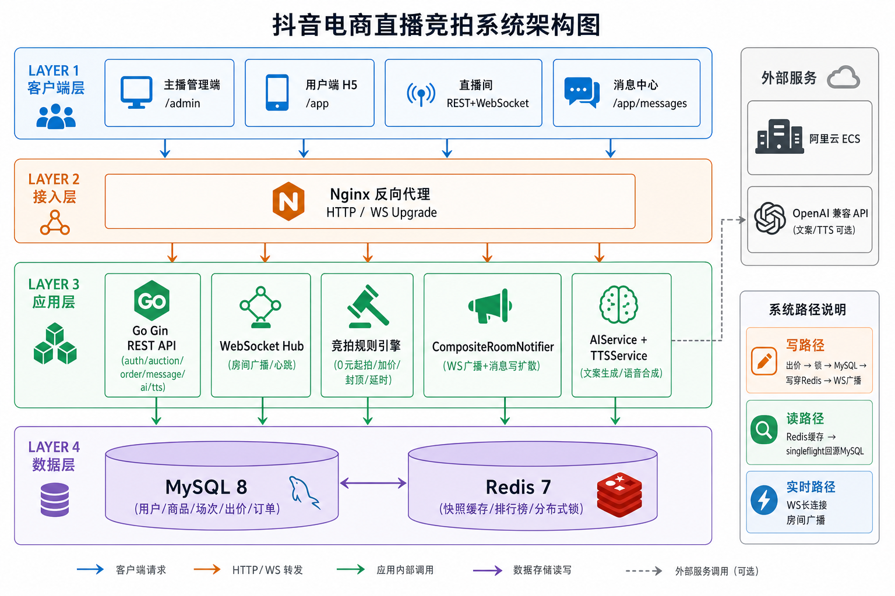

# 第二组-张丁懿-训练营结项报告

> **课题**：抖音电商 AI 全栈课题 — 直播竞拍全栈系统  
> **提交人**：张丁懿 · 北京邮电大学 · 电信工程及管理 · **独立完成**  
> **仓库**：https://github.com/zhangdingyi123/zhibo-master  
> **在线 Demo**：http://47.97.176.185  
> **文档日期**：2026-06-10

---

## 写在前面：这份报告想证明什么

训练营是**选拔性**活动，评委不仅看「功能有没有」，更看候选人是否具备：

1. **问题抽象能力** — 能否把直播竞拍拆成可落地的工程问题；
2. **技术判断力** — 选型是否有权衡，而非堆 buzzword；
3. **工程闭环能力** — 从设计、实现、压测、部署到可观测是否自成体系；
4. **风险意识** — 资金相关场景下，对一致性、幂等、降级的思考是否到位。

因此本报告在交付清单之外，重点补充 **「为什么这样设计」** 与 **「还考虑过什么、为什么没选」**。

---

# 第一部分 · 交付清单（快速索引）

## 1. 课题名称

**抖音电商 AI 全栈课题 — 直播竞拍全栈系统**

---

## 2. 团队与分工

| 姓名 | 学校 | 专业 | 角色 |
|------|------|------|------|
| 张丁懿 | 北京邮电大学 | 电信工程及管理 | 独立完成（全栈 + 部署 + 文档） |

| 模块 | 主要产出 |
|------|----------|
| 规则引擎、状态机、订单、数据模型 | `backend/internal/engine/`、`order_service.go`、`migrations/` |
| WebSocket、Redis 缓存与锁、压测与可观测 | `backend/internal/ws/`、`room_cache.go`、`bid_stress.sh` |
| 主播端、用户端 H5、直播间、消息中心 | `frontend/src/admin/`、`frontend/src/user/` |
| 联调、阿里云部署、结项材料 | `docs/`、`scripts/manual-deploy.sh` |

---

## 3. 核心功能（7 项）

| # | 能力 | 一句话 |
|:-:|------|--------|
| 1 | 主播端商品与竞拍管理 | CRUD、发布五元规则、改规则、取消、订单售后 |
| 2 | 竞拍规则引擎 | 0 元起拍、加价、封顶、延时、幂等、唯一胜者 |
| 3 | 用户端直播间 | WS 实时价/排名/倒计时，Mock 直播氛围 |
| 4 | 高并发防乱价 | Redis 锁 + MySQL 行锁，120 并发 5xx=0 |
| 5 | 订单履约闭环 | 成交建单、支付、发货、收货、超时关单 |
| 6 | AI 产品介绍 | 口播生成 + 解说条 + TTS 双通道兜底 |
| 7 | 非功能特性 | 断连重连、缓存一致性、压测、Grafana 监控告警 |

---

## 4. 在线 Demo

| 端 | 链接 |
|----|------|
| 用户端 | http://47.97.176.185/app |
| 直播间 | http://47.97.176.185/app/live/room_sess_1 |
| 主播端 | http://47.97.176.185/admin |
| Grafana | http://47.97.176.185/monitor/ （`admin` / `zhibo`） |
| JSON 指标 | http://47.97.176.185/api/v1/metrics |

体验账号：主播 `13800000001` / 买家 `13800000002`，密码 `123456`  
部署：阿里云 ECS 2C4G，Docker Compose；IP 直访（备案未完成，见 `docs/icp-filing.md`）。

---

## 5. 演示视频

建议 ≤3 分钟：① 发布竞拍 → ② 双端 WS 同步出价 → ③ 延时/封顶 → ④ 订单履约 → ⑤ AI 解说 / Grafana 一闪。

---

# 第二部分 · 项目背景与问题定义

## 6. 业务场景与核心挑战

直播竞拍不同于普通电商「一口价」：

| 挑战 | 说明 | 工程后果 |
|------|------|----------|
| **实时性** | 价格、倒计时、排名需全员同步 | 不能靠轮询；需要推送 + 断线补偿 |
| **并发写** | 结束前集中出价 | 必须防乱价、防重复扣款 |
| **规则复杂** | 0 元起拍、封顶、延时等多规则交织 | 不能散落在 if-else；需要可测试引擎 |
| **资金敏感** | 成交价影响订单金额 | 缓存不能当真相源；必须事务 + 幂等 |
| **体验分层** | 在场刺激感 + 离场可追溯 | WS 实时 + 消息落库双通道 |
| **AI 边界** | 课题要求 AI 全栈 | AI 增强带货，但不能参与定价决策 |

**项目目标**：在单机可部署的前提下，交付一条 **可演示、可压测、可监控** 的竞拍全栈链路，体现工程深度而非 CRUD Demo。

---

# 第三部分 · 技术选型与思路（Why）

> 选型原则：**课题周期内可交付 > 过度架构**；但在关键路径（出价、一致性）上不做妥协。

## 7. 技术栈总览

| 层级 | 选型 | 核心理由 |
|------|------|----------|
| 后端 | Go 1.22 + Gin | 高并发写路径、单二进制部署、与训练营时间匹配 |
| 前端 | React 19 + TS + Vite | 管理端与用户端同仓、组件复用、类型安全 |
| 主库 | MySQL 8 | 事务 + 行锁，电商资金场景成熟方案 |
| 缓存 | Redis 7 | 快照读优化、排行榜 ZSET、分布式锁 |
| 实时 | 自研 WebSocket Hub | 房间广播模型简单，无需引入 MQ |
| 网关 | Nginx | 统一 HTTP/WS 反代，生产与本地一致 |
| AI | OpenAI 兼容 API | 文案 + TTS 单点接入，Key 可选 |
| 可观测 | Prometheus + Grafana | 轻量、与 Docker Compose 契合 |

架构图见 `docs/zhibo-system-architecture.png`。

---

## 8. 分项选型：考虑过什么、为什么这样选

### 8.1 后端：Go + 分层 monolith

| 方案 | 优点 | 未选原因 |
|------|------|----------|
| **Go 单体（选用）** | 编译快、goroutine 适合 WS Hub、部署简单 | — |
| Java Spring | 生态成熟 | 2C4G 单机内存压力大，交付周期长 |
| Node.js 全栈 | 前后端统一语言 | CPU 密集的规则 + 事务逻辑不如 Go 清晰 |
| 微服务拆分 | 可独立扩展 | 课题阶段运维成本高，单房间演示无必要 |

**分层**：`api → service → domain → infra`，规则引擎独立于 Service，便于单测与压测时替换依赖。

---

### 8.2 数据：MySQL 真相源 + Redis 读优化（而非 Redis 主存）

| 方案 | 优点 | 未选原因 |
|------|------|----------|
| **MySQL 真相 + Redis 缓存（选用）** | 资金一致性强；Redis 故障可降级 | — |
| Redis 存当前价 | 极快 | 宕机丢价；与订单对账困难 |
| 仅 MySQL | 最简单 | 快照高频读打穿 DB，直播体验差 |

**关键判断**：竞拍价格是**资金相关状态**，必须满足「DB 为准、缓存可重建」。因此写路径 **Write-Through**，读路径 **Cache-Aside**，而非「先写 Redis 异步落库」。

---

### 8.3 实时：WebSocket Hub（而非 SSE / 轮询 / Kafka）

| 方案 | 优点 | 未选原因 |
|------|------|----------|
| **WS Hub 按 roomId 广播（选用）** | 双向、低延迟、可 WS 出价 | — |
| 短轮询 REST | 实现简单 | 100+ 人在线 QPS 爆炸；延迟明显 |
| SSE | 服务端推送简单 | 单向；难承载 WS 出价 |
| Kafka + 推送服务 | 可扩展 | 单机课题过重 |

**补偿设计**：Hub 内 `EventStore` 环形缓冲 + 客户端 `lastSeq`，解决弱网断连后的状态追赶——这是选 WS 时必须补齐的一环。

---

### 8.4 并发：Redis 锁 + MySQL 行锁（而非仅靠乐观锁）

| 方案 | 优点 | 未选原因 |
|------|------|----------|
| **Redis 场次锁 + DB 行锁 + 幂等（选用）** | 冲突前置、终价可证 | — |
| 仅乐观锁 | 无 Redis 依赖 | 120 并发大量 version 冲突，体验差 |
| 仅 Redis 锁 | 快 | Redis 故障时无保护；需 DB 兜底 |

**为什么三层**：L1 幂等挡重复请求；L2 Redis 锁降低 DB 冲突概率；L3 行锁 + version 保证**即使 Redis 失效**（`NoopLocker` 降级）仍不会双写。

---

### 8.5 规则：独立引擎（而非 Controller 内 if-else）

| 方案 | 优点 | 未选原因 |
|------|------|----------|
| **纯函数 `auction_engine`（选用）** | 可单测、可压测、规则可文档化 | — |
| 数据库触发器 | 强一致 | 难测试、难扩展延时/封顶组合逻辑 |
| 工作流引擎 | 通用 | 课题过重，规则域模型已足够 |

**为什么值得单独做**：延时窗口、封顶成交、0 元起拍等组合边界多；引擎输出结构化 `Outcome`，`BidService` 只负责事务持久化——**决策与 IO 分离**是后续改规则不炸库的前提。

---

### 8.6 AI：单点嵌入（而非 Agent 参与交易）

| 方案 | 优点 | 未选原因 |
|------|------|----------|
| **文案 + 解说 + TTS（选用）** | 贴合直播带货；确定性边界清晰 | — |
| LLM 参与出价建议 | 话题性强 | 资金风险不可控；评委难验证 |
| RAG 商品知识库 | 可扩展 | 超出课题周期，非核心路径 |

**原则**：AI 失败可降级（模板文案 / 浏览器 TTS），**出价路径零 AI 依赖**。

---

### 8.7 部署：Docker Compose 单机 ECS（而非 K8s）

| 方案 | 优点 | 未选原因 |
|------|------|----------|
| **Compose 单机（选用）** | 2C4G 可跑全栈；答辩可复现 | — |
| K8s | 可扩展 | 备案 + 集群成本对训练营过高 |
| Serverless | 免运维 | WS 长连接不友好 |

**现实约束**：域名 ICP 备案阻塞后，采用 **IP 直访** 保障演示——这是部署层面的 trade-off，已文档化于 `docs/icp-filing.md`。

---

# 第四部分 · 关键设计决策（Why + How）

## 9. 决策 1：规则引擎与状态机分离

**问题**：场次 `pending/running/settled/cancelled` 与「这一笔出价是否接受」是两类逻辑，混在一起会导致改规则时误伤状态流转。

**决策**：
- `session_status.go`：只管**合法状态迁移**；
- `auction_engine`：只管**单笔出价决策**（加价够不够、要不要延时、是否封顶成交）；
- `BidService`：事务内先引擎、后持久化、再通知。

**为什么**：
- 引擎无 IO，**10+ 单测**覆盖边界；
- 状态机可独立画进文档，评委一眼能审规则；
- 新增规则（如改延时秒数）只动引擎，不动订单/WS。

**验证**：`engine/*_test.go` + 集成出价 API。

---

## 10. 决策 2：三层并发防护

**问题**：单房间 100+ 人同时点出价，可能出现超卖、价回退、重复落库。

**决策**：

```
requestId 幂等 → Redis 场次锁 → MySQL FOR UPDATE + version
```

**为什么分层**：

| 层 | 解决什么 | 若去掉会怎样 |
|----|----------|--------------|
| 幂等 | 网络重试、双击 | 同一用户扣两次 |
| Redis 锁 | 同房间并发写 | 乐观锁冲突飙升，P99 变差 |
| DB 行锁 | 最终原子性 | 极端情况下价不一致 |

**验证**：外网 120 并发，`5xx=0`，`bid_count=1`，DB 终价与页面一致（`docs/load-test-report.md`）。

---

## 11. 决策 3：读写路径分离的缓存一致性

**问题**：直播读多写少，但不能为快而牺牲价正确。

**决策**：

| 路径 | 策略 | 为什么 |
|------|------|--------|
| 写出价 | Write-Through | 先提交 DB 再写 Redis；DB 失败则不写缓存 |
| 读快照 | Cache-Aside + singleflight | 热点 Miss 时合并回源，防击穿 |
| 不存在房间 | null 标记 60s | 防穿透打 DB |
| 倒计时 | 读出时按 serverTime 重算 | 避免缓存 TTL 导致展示过期 |
| Redis 挂 | NoopLocker + 直读 DB | 可用性优先，性能降级可接受 |

**为什么不选「先写 Redis 异步写 DB」**：异步窗口内崩溃会导致页面价与订单价分裂——电商场景不可接受。

---

## 12. 决策 4：「在场 + 离场」双通道通知

**问题**：纯 WS 用户离场即失联；纯站内信又没有直播瞬时感。

**决策**：`CompositeRoomNotifier` 一次事件 → WS 广播 + `user_messages` 写扩散。

**为什么**：
- 在场：毫秒级价板、排名、Toast；
- 离场：被超越、成交、取消可回看、可跳回直播间；
- 符合抖音式「即时 + 留存」产品逻辑，且实现成本可控（同一次出价回调内完成）。

---

## 13. 决策 5：断连重连与增量补偿

**问题**：移动端弱网、切后台会导致 WS 断开，回来若全量刷新体验差，若不同步则价不一致。

**决策**：
- 客户端：指数退避重连 + `lastSeq` 持久化；
- 服务端：`EventStore` 缓冲 + `sync { snapshot, events }` 补发。

**为什么不用「重连后只拉 REST 快照」**：会丢失中间事件（如「你被超越」Toast、延时动画）；增量补偿更贴近真实直播体验。

---

## 14. 决策 6：Mock 直播氛围与真实数据分层

**问题**：课题无真实推流，但需「直播感」。

**决策**：
- **真实层**：价格、倒计时、排名、订单 — 全部来自 API/WS；
- **氛围层**：Ken Burns 封面、弹幕、点赞 — 纯前端 Mock，不写库。

**为什么**：避免演示数据污染资金逻辑；将来接 SRS/HLS 只替换 `LiveVideo`，竞拍链路不动（见 `docs/streaming.md`）。

---

# 第五部分 · 系统架构与数据流

## 15. 架构图



## 16. 四条核心链路

| 链路 | 路径 | 设计意图 |
|------|------|----------|
| **写：出价** | Client → Nginx → API → Redis 锁 → MySQL → 写穿 Redis → WS + 消息 | 强一致 + 广播 |
| **读：快照** | Client → API → Redis →（Miss）singleflight → MySQL | 扛住围观流量 |
| **实时** | WS Hub 按 roomId 广播结构化事件 | 低延迟同步 |
| **AI** | 管理端生成 description → 用户端轮播 + TTS | 与资金路径隔离 |

---

# 第六部分 · 非功能特性工程化

## 17. 系统可用性

### 17.1 断连重连

| 机制 | 实现 | 为什么 |
|------|------|--------|
| 指数退避 | 1s → 2s → … → 30s | 防惊群，减轻故障时服务端压力 |
| lastSeq | localStorage + subscribe | 精确定位缺失事件 |
| EventStore | 环形缓冲 256 条 | 内存可控，够覆盖短断网 |
| 心跳 | 25s ping | 尽早发现死连接 |

### 17.2 异常兜底

| 场景 | 策略 | 原则 |
|------|------|------|
| Redis 不可用 | NoopLocker + 直读 MySQL | 核心路径可用 |
| 出价冲突 | HTTP 409 | 业务拒绝 ≠ 服务崩溃 |
| LLM/TTS 失败 | 模板 / 浏览器语音 | 非核心降级 |
| 支付超时 | 30min 关单 | 防止僵尸订单 |

---

## 18. 性能

| 场景 | 结果 | 说明 |
|------|------|------|
| 120 并发出价 | RPS 195.1，P50 460ms，**5xx=0** | 外网全链路含 Nginx |
| 5000 次快照读 | RPS 98.9，P50 146ms | 验证缓存有效 |

**为什么够用的标准**：课题目标是单房间 **100+ 并发**，不是全网峰值；在 2C4G 单机达成，说明架构瓶颈识别准确（瓶颈在 DB 行锁而非 Gin）。

复现：`backend/scripts/bid_stress.sh`。

---

## 19. 稳定性与一致性

- **击穿**：singleflight 合并回源  
- **穿透**：`null` 标记 TTL 60s  
- **终态**：settled/cancelled 后 Invalidate + Refresh  
- **文档**：`docs/cache-consistency.md`、`docs/mysql-redis.md`

---

## 20. 可观测性

| 入口 | 用途 |
|------|------|
| `/api/v1/metrics` | 调试 JSON |
| `/metrics` | Prometheus 抓取 |
| `/monitor/` | Grafana 竞拍大盘 |

**为什么做监控**：选拔性答辩中，「我说扛住了 120 并发」需要**曲线佐证**；告警规则（写穿失败、失败率过高）体现运维意识。

告警：`deploy/prometheus/alerts.yml`  
部署：`bash scripts/observability-up.sh`

---

# 第七部分 · AI 能力

## 21. 运行时 AI

| 能力 | 接口 | 为什么这样设计 |
|------|------|----------------|
| 口播生成 | `POST /admin/products/ai-intro` | 主播提效；生成后可编辑 |
| 解说条 | `AICommentaryBar` | 消费已存 description，不实时调 LLM（省成本、稳演示） |
| TTS | `/api/v1/tts` + SpeechSynthesis | 云端优先，失败浏览器兜底 |

**Prompt**（`ai_service.go` → `buildIntroPrompt`）：

```
你是抖音电商直播带货文案助手…
要求：150–220 字、口语化、2–3 卖点、结尾催拍、纯文本输出
```

**未采用**：RAG、对话 Agent、AI 出价——与确定性资金路径隔离。

## 22. 研发阶段 AI 工具

Cursor Agent：代码生成、重构、联调、文档；Claude/GPT：架构草稿、测试与压测脚本补全。

---

# 第八部分 · 项目亮点与能力自证

## 23. 亮点（评委速览）

| 亮点 | 能力体现 |
|------|----------|
| 规则引擎 + 双层锁 | 领域建模、可测试性、并发意识 |
| MySQL 真相源 + Redis | 一致性权衡、缓存治理 |
| 双通道通知 | 产品思维 + 工程落地 |
| AI 精准嵌入 | 全栈视野 + 风险边界 |
| 压测 + Grafana | 工程验证闭环 |
| 备案阻塞仍交付 Demo | 问题解决与文档化能力 |

## 24. 与「普通 CRUD 项目」的差异

| 维度 | 普通 Demo | 本项目 |
|------|-----------|--------|
| 竞拍规则 | 表单字段 | 独立引擎 + 10+ 单测 |
| 并发 | 未验证 | 120 并发压测 + 终价唯一 |
| 实时 | 轮询或未做 | WS + 断连补偿 |
| 缓存 | 直接用 Redis | 真相源 + 击穿/穿透/降级 |
| AI | 泛泛接入 | 单点 + 多级兜底 + 边界清晰 |
| 运维 | 无 | Prometheus + Grafana + 告警 |

---

# 第九部分 · 附录

## 25. 端到端使用流程

1. 主播 `/admin` 登录 → 创建商品 → 配置规则 → 发布竞拍  
2. 买家 `/app` 进直播间 → WS 订阅  
3. 出价 → 引擎校验 → 全房同步  
4. 延时 / 封顶 → 成交 → 订单  
5. 支付 → 发货 → 收货；异常走售后 + 消息中心  

## 26. 本地运行

```bash
docker compose up -d
cd backend && go run ./cmd/server
cd frontend && npm install && npm run dev
```

详见根目录 `README.md`、`docs/deploy-aliyun.md`。

## 27. 参考文档索引

| 文档 | 路径 |
|------|------|
| 任务清单 | `TASKS.md` |
| API 规范 | `docs/api-spec.md` |
| WS 协议 | `docs/ws-protocol.md` |
| 数据模型 | `docs/data-model/README.md` |
| MySQL/Redis | `docs/mysql-redis.md` |
| 缓存一致性 | `docs/cache-consistency.md` |
| 压测报告 | `docs/load-test-report.md` |
| 可观测 | `docs/observability.md` |
| 备案说明 | `docs/icp-filing.md` |

## 28. 评测与走查记录

| 评测项 | 方法 | 结论 |
|--------|------|------|
| 规则正确性 | `engine/*_test.go` | 边界覆盖 |
| 并发一致性 | `bid_stress.sh` + 查 DB | 终价唯一 |
| 端到端 | 双浏览器 + 断网重连 | 状态一致 |
| API 契约 | `docs/api-spec.md` | 前后端对齐 |

---

*本报告在交付清单基础上补充选型权衡与设计动机，用于训练营结项答辩与能力展示。*
