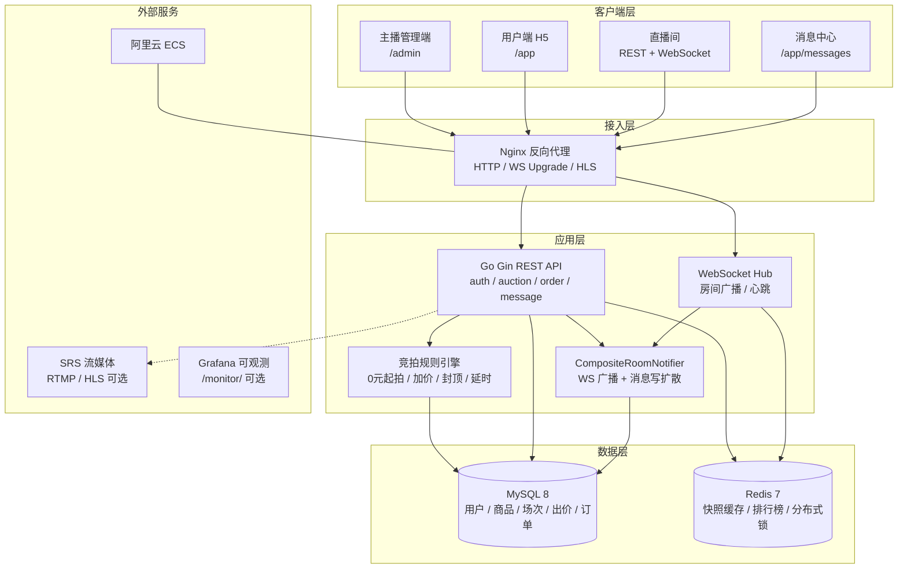

# 第二组-【请填写姓名】-训练营结项文档

> 飞书标题建议：`第二组-{你的姓名}-训练营结项文档`  
> 文档生成日期：2026-06-09

---

## 1. 课题名称

**抖音电商 AI 全栈课题 — 直播竞拍全栈系统**

> 与课题宣讲版及最终提交页保持一致，便于评委快速识别：电商直播场景 + 竞拍规则引擎 + 全栈工程交付。

---

## 2. 团队名称与成员名单

**团队名称**：第二组 · 【请填写队名】

| 姓名 | 学校 | 专业 | 角色 |
|------|------|------|------|
| 【请填写】 | 【请填写】 | 【请填写】 | 队长 / 后端 |
| 【请填写】 | 【请填写】 | 【请填写】 | 后端 |
| 【请填写】 | 【请填写】 | 【请填写】 | 前端 |

> 若为单人完成，保留一行并注明「独立完成」即可。

---

## 3. 分工说明

| 成员 | 负责模块 | 主要产出 |
|------|----------|----------|
| 【后端 A】 | 规则引擎、竞拍状态机、订单、MySQL 数据模型 | `backend/internal/engine/`、`order_service.go`、DDL 迁移 |
| 【后端 B】 | WebSocket 实时推送、Redis 缓存与分布式锁、压测与可观测 | `backend/internal/ws/`、`room_cache.go`、`bid_stress.sh` |
| 【前端】 | 主播管理端、用户端 H5、直播间 WS 客户端、消息中心 UI | `frontend/src/admin/`、`frontend/src/user/` |
| 【全员】 | 联调验收、阿里云部署、演示录屏、结项材料 | `docs/`、`scripts/manual-deploy.sh` |

---

## 4. 核心功能清单

1. **主播端商品与竞拍管理**：商品 CRUD、发布竞拍（起拍价 / 加价幅度 / 封顶 / 时长 / 延时）、规则修改、异常取消、订单查询。
2. **竞拍规则引擎**：支持 0 元起拍、加价幅度校验、封顶立即成交、结束前 N 秒出价自动延时、出价幂等（`requestId`）与唯一胜者判定。
3. **用户端直播间实时体验**：WebSocket 推送当前价、倒计时、排名变化；REST 出价；多浏览器同房间状态同步。
4. **高并发出价防乱价**：Redis 分布式锁 + MySQL 行锁与乐观锁双层保护，120 并发压测 0 次 5xx，DB 最终价一致。
5. **成交订单与履约闭环**：场次成交自动生成订单，支持待支付超时关单（默认 30 分钟）、模拟支付、填写收货地址、主播发货与用户确认收货（`pending_pay` → `paid` → `shipped` → `completed`）。
6. **售后异常流**：支持误拍取消（买家/主播取消待支付）、主播模拟退款（已支付/已发货 → `refunded`），原因模板 + 站内消息通知，覆盖「出问题怎么办」闭环。
7. **站内消息中心（写扩散）**：被超越、延时、成交、取消、订单取消/退款等事件落库 `user_messages`，Bento 卡片式消息 UI。
8. **AI 产品介绍**：管理端一键生成直播口播稿；用户端直播间解说条轮播 + TTS 语音解说（云端 / 浏览器双通道）。

---

## 5. 端到端使用流程

1. 主播使用手机号登录管理端（`/admin`），创建商品并填写名称、图片与介绍。
2. 主播发布竞拍场次，配置起拍价、加价幅度、封顶价、竞拍时长与延时秒数。
3. 买家在用户端（`/app`）注册 / 登录后，进入竞拍列表并点击进入直播间。
4. 直播间通过 WebSocket 订阅房间，实时展示当前最高价、参与人数与倒计时。
5. 买家输入出价金额并提交，后端规则引擎校验通过后更新价格，并向全房间广播最新快照与排名。
6. 若结束前仍有新出价，系统自动延长倒计时；若达到封顶价则立即成交。
7. 竞拍结束后，系统为胜者生成订单，买家在「我的订单」中完成 Mock 支付并填写收货地址。
8. 主播在管理端查看订单并发货（可填物流单号），买家确认收货后订单完成。
9. **异常售后**：待支付误拍可由买家主动取消或主播协商取消；已支付/已发货订单由主播在管理端发起模拟退款；取消/退款原因落库并推送 `order_cancelled` / `order_refunded` 消息。
10. 相关通知（被超越、成交、售后等）同步写入消息中心，用户可在 `/app/messages` 查看历史与未读角标。

---

## 6. 在线 Demo 链接

| 端 | 链接 | 说明 |
|----|------|------|
| 用户端 | http://47.97.176.185/app | 竞拍列表、登录注册 |
| 直播间 | http://47.97.176.185/app/live/room_sess_1 | 实时出价演示 |
| 主播端 | http://47.97.176.185/admin | 商品与场次管理 |
| API 健康检查 | http://47.97.176.185/api/v1/health | 服务存活探测 |
| 可观测指标 | http://47.97.176.185/api/v1/metrics | 出价 / 缓存 / WS 指标 |

**体验账号**（密码均为 `123456`）：

| 角色 | 手机号 |
|------|--------|
| 主播 | `13800000001` |
| 买家 | `13800000002` |

> 部署环境：阿里云 ECS `47.97.176.185`（2C4G），Docker Compose 单机栈。域名因 ICP 备案未完成，采用 IP 直访；详见 `docs/icp-filing.md`。

---

## 7. 演示视频链接

| 项 | 内容 |
|----|------|
| 视频链接 | 【待上传：飞书附件 / B 站 / 飞书妙记 公开链接】 |
| 建议时长 | ≤ 3 分钟（可适当加速） |
| 建议内容 | ① 主播发布竞拍 → ② 用户进房出价与 WS 同步 → ③ 延时 / 封顶场景 → ④ 成交订单与支付 → ⑤ 高并发压测片段（可选） |

> 若暂未录制，可将录屏文件直接拖入飞书文档「附件区」（见文末）。

---

## 8. 源代码仓库链接

| 项 | 内容 |
|----|------|
| 主仓库 | https://github.com/zhangdingyi123/zhibo-master |
| 默认分支 | `main` |
| 最后提交 | `44ed461` — `技术债`（2026-06-08 20:07:48 +0800） |
| 技术栈 | Go 1.22+ / Gin + React 19 / TypeScript / Vite + MySQL 8 + Redis 7 |

**目录说明**：`backend/` 后端 API · `frontend/` 前端应用 · `docs/` 设计与部署文档 · `scripts/` 部署与压测脚本。

---

## 9. README / 运行说明

### 9.1 项目简介

Go 后端 + React 前端 monorepo，实现直播场景下的竞拍全栈系统，覆盖管理端、用户端、WebSocket 实时通信、规则引擎、订单与消息中心。任务清单见根目录 `TASKS.md`。

### 9.2 依赖环境

| 依赖 | 版本要求 |
|------|----------|
| Go | 1.22+ |
| Node.js | 18+（推荐 LTS） |
| Docker / Docker Compose | 用于 MySQL 8 + Redis 7 |
| hey（压测可选） | `go install github.com/rakyll/hey@latest` |

### 9.3 本地启动步骤

```bash
# 1. 基础设施
docker compose up -d

# 2. 后端（项目根目录）
cp .env.example .env    # 可选
cd backend && go run ./cmd/server
# 默认 http://localhost:8081 ，健康检查 GET /api/v1/health

# 3. 前端
cd frontend && npm install && npm run dev
# 浏览器打开 http://localhost:5173
```

演示账号：主播 `13800000001` / 买家 `13800000002`，密码 `123456`。

### 9.4 目录结构

```
zhibo-master/
├── backend/              # Go API（api / service / domain / infra / ws / engine）
│   ├── cmd/server/       # 入口
│   ├── internal/         # 业务逻辑
│   └── migrations/       # DDL 与种子数据
├── frontend/             # React 应用（admin / user / components）
├── docs/                 # 架构、API、部署、压测文档
├── scripts/              # manual-deploy.sh、压测脚本等
├── docker-compose.yml    # 本地 MySQL + Redis
└── docker-compose.prod.yml  # 生产编排
```

### 9.5 配置说明

复制 `.env.example` 为 `.env`，主要变量：

| 变量 | 说明 | 默认值 |
|------|------|--------|
| `PORT` | 后端端口 | `8081` |
| `MYSQL_DSN` | MySQL 连接串 | `zhibo:zhibo@tcp(localhost:3306)/zhibo?...` |
| `REDIS_ADDR` | Redis 地址 | `localhost:6379` |
| `JWT_SECRET` | JWT 签名密钥 | 开发默认值（生产务必修改） |
| `FRONTEND_URL` | CORS 允许来源 | `http://localhost:5173` |
| `PAY_TIMEOUT_MINUTES` | 待支付关单时间 | `30` |

生产部署详见 `docs/deploy-aliyun.md`，一键脚本：`./scripts/manual-deploy.sh`。

---

## 10. 系统架构图



**调用关系摘要**：

- 写路径（出价）：客户端 → Nginx → API → Redis 锁 → MySQL 事务 → 写穿 Redis → WS 广播 + 消息落库
- 读路径（快照）：客户端 → Nginx → API → Redis 缓存 → Miss 时 singleflight 回源 MySQL
- 实时路径：直播间 WS 长连接 → Hub 按 `roomId` 广播 `bid_new` / `rank_update` / `countdown` 等事件

---

## 11. 大模型 / AI 能力使用说明

> 本课题为 **「AI 全栈」工程实践**：研发阶段以 Cursor Agent 提效；**运行时接入「AI 产品介绍」单点能力**（文案生成 + 直播间解说条 + TTS），不参与出价与订单等确定性逻辑。

### 11.1 运行时 AI：智能产品介绍

| 能力 | 接口 / 组件 | 说明 |
|------|-------------|------|
| **卖点文案生成** | `POST /api/v1/admin/products/ai-intro` | 主播输入商品名与关键词，大模型生成直播口播稿；未配置 `AI_API_KEY` 时降级为模板文案 |
| **直播间解说条** | `AICommentaryBar` | 将 `products.description` 按句轮播，叠加在直播画面区 |
| **实时 TTS 语音** | `POST /api/v1/tts` + 浏览器 SpeechSynthesis 兜底 | 优先云端 TTS（OpenAI 兼容）；失败或未配置时自动用浏览器中文语音 |

**人工把关**：文案生成后主播可编辑再保存；竞拍规则、出价、成交仍由 `auction_engine` 严格执行，AI 不介入资金与状态机。

**演示路径**：管理端「✨ AI 生成介绍」→ 保存商品 → 用户端进房 → 开启「解说开」→ 画面底部解说条 + 语音播报。

### 11.2 研发阶段使用的 AI 工具

| 工具 | 用途 | 在流程中的位置 |
|------|------|----------------|
| **Cursor Agent** | 代码生成、重构、联调排错、文档撰写 | 全周期结对编程 |
| **Claude / GPT 系列** | 架构方案草稿、单元测试补全、压测脚本 | 设计评审前初稿 → 人工定稿 |

### 11.3 典型 AI 辅助场景（研发向）

| 场景 | AI 产出 | 人工把关 |
|------|---------|----------|
| ER 图与状态机设计 | 表结构、状态流转草稿 | 并发一致性、金额 `BIGINT` 分单位 |
| 规则引擎实现 | `auction_engine.go` 测试用例骨架 | 边界条件（封顶、延时窗口）逐条验证 |
| Redis Key 与缓存策略 | Write-Through / Cache-Aside 方案 | 终态失效策略、singleflight 防击穿 |
| 前端 Bento 消息 UI | 组件结构与样式初稿 | 交互细节、未读角标与跳转 |
| 部署与 Nginx 配置 | `docker-compose.prod.yml` 草稿 | 安全组、JWT、生产密码 |
| 文档材料 | 周报、压测报告、API 文档 | 数据核实、答辩口径 |

### 11.4 未使用的 AI 组件（如实说明）

- ❌ RAG / 向量数据库
- ❌ 通用对话 Agent / 在线 Prompt 编排平台
- ❌ AI 参与出价、定价或订单决策

**AI 全栈体现**：运行时「产品介绍」闭环 + Cursor Agent 研发提效；关键工程决策（分布式锁粒度、幂等 `dedupe_key`、写扩散消息）均由开发者评审后落地。

---

## 12. 关键工程难点与解决方案

### 难点 1：高并发出价防乱价

**问题**：单房间 100+ 用户同时出价，若仅依赖应用层校验，可能出现超卖、价格回退或重复扣款。

**方案**：

1. **Redis 分布式锁**（场次粒度）串行化同一房间的出价请求；
2. **MySQL 事务**内 `SELECT ... FOR UPDATE` + `version` 乐观锁，保证单行快照原子更新；
3. **`requestId` 幂等**：`(session_id, request_id)` 唯一索引，重复请求直接返回原结果。

**验证**：120 并发外网压测，仅 1 笔有效出价，119 笔 409 冲突（预期），**5xx = 0**，压测后 `currentPrice` 与 DB 一致。

### 难点 2：毫秒级实时同步与读性能

**问题**：直播间需同步价格、倒计时、排名；高频读快照不能每次打穿 MySQL。

**方案**：

1. **WebSocket Hub** 按 `roomId` 广播结构化事件（`bid_new`、`rank_update`、`countdown_tick`）；
2. **Redis 快照缓存** + `singleflight` 防缓存击穿；倒计时在读出时按 `serverTimeMs` 重算，避免展示过期；
3. **CompositeRoomNotifier**：出价成功后同时触发 WS 广播与站内消息写扩散。

**验证**：快照读压 5000 次 / 100 并发，RPS 98.9，P50 146ms，失败 0。

### 难点 3：生产部署与域名备案阻塞

**问题**：GoDaddy 注册域名不在工信部批复名单，无法完成 ICP 备案，公网域名访问被拦截。

**方案**：

1. 阿里云 ECS + `docker-compose.prod.yml` 一键部署全栈（MySQL / Redis / Nginx / 前后端）；
2. 采用 **公网 IP 直访** `http://47.97.176.185` 保障答辩演示；
3. 文档化备案路径与 HTTPS 后续方案（`docs/icp-filing.md`、`docs/deploy-aliyun.md`）。

---

## 13. 项目亮点 / 创新点

1. **规则引擎零漏洞落地**：0 元起拍、加价幅度、封顶成交、自动延时、异常取消均在 `auction_engine` 单测 + 集成测试中覆盖，非简单 CRUD 堆砌。
2. **MySQL 真相源 + Redis 读优化双层架构**：Write-Through 出价 + Cache-Aside 快照 + Redis 不可用时自动降级为纯 DB 模式，兼顾一致性与可用性。
3. **实时双通道通知**：直播间 WS 毫秒级同步 + 消息中心写扩散落库，兼顾「在场体验」与「离场可追溯」，UI 采用 Bento + Glassmorphism 差异化呈现。

---

## 14. 直播感与运营能力

> 课题要求覆盖「电商直播场景」的体验与主播侧运营闭环。本节说明：**如何在无真实推流依赖的前提下营造直播氛围**，以及**主播端如何完成从上架到成交的全流程运营**。

### 14.1 直播感（用户端在场体验）

当前版本采用 **Mock 占位画面 + 实时竞拍数据** 的分层设计（详见 `docs/streaming.md`）：视频区营造氛围，出价 / 排名 / 倒计时走 WebSocket，互不阻塞。SRS / RTMP / HLS 能力保留在 `deploy/srs.conf` 与 `scripts/stream_demo.sh`，答辩演示不依赖推流即可完整走通竞拍链路。

| 体验要素 | 实现方式 | 用户感知 |
|----------|----------|----------|
| **直播画面** | 商品封面 Ken Burns 缩放 + 扫描线 / 光晕 / 暗角叠加 | 画面有「在播」动感，非静态商品页 |
| **LIVE 角标** | 固定红色 LIVE 标识 + 基于参与人数波动的「X 人在看」 | 强化实时在场感 |
| **弹幕层** | 真实出价事件触发「有人出价 ¥X」；定时注入氛围弹幕（如「冲冲冲」） | 房间热闹、竞价有张力 |
| **互动点赞** | 心形粒子上浮动画 + 按钮脉冲反馈 | 轻量互动，贴近直播间习惯 |
| **价格看板** | 当前价大字展示；剩余 ≤10s 进入 urgent 高亮样式 | 倒计时紧迫感，促进临门一脚出价 |
| **实时同步** | WS 推送 `bid_new` / `rank_update` / `countdown_tick` / `auction_extended` | 多浏览器同房间价格、排名、倒计时一致 |
| **情绪反馈** | Toast 栈（被超越 / 延时 / 成交 / 取消）+ 可选提示音 + 被超越全屏闪红 | 领先位变化可感知，减少「静默掉价」 |
| **排名榜** | 侧栏实时排行榜，当前用户高亮 | 竞争可视化，刺激追价 |
| **成交闭环** | 竞拍结束自动跳转结果页，引导 Mock 支付 | 从「看播」到「下单」路径完整 |
| **AI 解说** | `AICommentaryBar` 轮播商品介绍 + 可选 TTS 语音 | 「边听边抢」，贴近真人带货讲解 |

**设计取舍**：直播感优先落在 **竞拍节奏与社交氛围**（弹幕、点赞、倒计时、排名），而非长视频码流——与抖音电商「直播带货 + 限时竞价」的核心转化路径一致；真实推流可作为后续扩展，不影响当前答辩演示。

### 14.2 运营能力（主播端：从「能用」到「好用」）

主播通过 `/admin` 完成 **商品 → 场次 → 中控台 → 订单** 全链路；二期重点强化 **直播中控台** 与 **数据驱动运营**，减少在商品详情页来回跳转。

| 运营环节 | 能力 | 说明 |
|----------|------|------|
| **数据概览** | Dashboard 统计卡片 | 进行中场次、待开始、已成交、待支付订单、模拟收款合计、商品总数一目了然 |
| **转化漏斗** | 直播中控台 `ConversionFunnel` | **进房人数（WS 连接）→ 出价人数 → 成交 → 支付完成**，附智能诊断提示，帮助判断是流量问题还是规则问题 |
| **场次模板** | `AuctionRulesForm` 一键套用 | 内置「0 元起拍 + 10 秒延时」「快节奏秒杀」「封顶一口价」等常用规则，减少重复配置 |
| **直播中控台** | `LiveRoomConsolePage` | 集中展示 **当前价 / 倒计时 / 一键切品 / 紧急下架**；订阅 WS 实时看板，无需跳转商品详情 |
| **多品连播** | 直播房间 + 队列 | 创建直播 → 添加商品队列 → 开播后一键切品，用户端 `ProductStrip` 同步切换 |
| **定时开播** | `scheduledStartAt` + 预约卡片 | 管理端可设计划开拍时间；用户端列表 / 详情 / 直播间展示 **预约开拍倒计时** |
| **商品管理** | CRUD + 封面 / 介绍 | 上架前维护商品素材，为直播间 Mock 画面提供封面源 |
| **异常处理** | 紧急下架 / 取消竞拍 | 中控台一键下架当前品；状态回滚 + WS 广播 + 消息通知 |
| **订单售后** | 取消 / 模拟退款 | 待支付误拍：买家/主播取消；已支付/已发货：主播退款；原因模板 + 站内消息 |
| **订单运营** | 订单列表与详情 | 成交后查看待支付 / 已支付 / 已退款；系统默认 30 分钟未支付自动关单 |
| **用户触达** | 消息中心写扩散 | 被超越、延时、成交、取消等事件落库，用户离场后仍可追溯并一键回直播间 |

**运营与引擎联动**：主播在管理端配置的规则（封顶、延时窗口等）由 `auction_engine` 严格执行；中控台通过 WebSocket 订阅与 REST 漏斗数据结合，实现「配置即生效、数据可诊断」。

### 14.3 演示建议（答辩口径）

1. **直播感**：双浏览器进同一房间，一方出价 → 另一方价格 / 弹幕 / Toast 同步；最后 10 秒展示 urgent 样式与延时场景。
2. **运营能力**：管理端创建直播 → 套用场次模板上架 → 中控台展示转化漏斗与实时倒计时 → 用户端成交 → 订单待支付 → Mock 支付完成。
3. **预约开拍**：设置 `scheduledStartAt` → 用户端列表 / 直播间展示预约倒计时卡片。
4. **售后异常**：演示误拍场景——买家取消待支付，或支付后主播在订单详情发起退款 → 买家消息中心收到通知 → 订单状态变为已取消/已退款。
5. **AI 产品介绍**：管理端「✨ AI 生成介绍」→ 保存 → 用户端进房点「解说开」→ 画面底部解说条轮播 + 语音播报。

---

## 15. 其余材料（可选）

### 15.1 性能指标 / 压测结果

| 场景 | 指标 | 结论 |
|------|------|------|
| 并发出价（120 并发，外网 → ECS） | RPS **195.1**，P50/P99 **460 / 577 ms**，5xx **0** | 满足单房间 100+ 并发目标 |
| 快照读（5000 次，100 并发） | RPS **98.9**，P50 **146 ms**，失败 **0** | 缓存有效，`cacheHits=288` |
| 业务一致性 | 压测后 `currentPrice=10000`、`bidCount=1` | 仅 1 笔有效出价 |
| 月成本 | ECS 约 50–100 元 | 无运行时模型 API 费用 |

完整报告：`docs/load-test-report.md`

### 15.2 Prompt 策略 / Agent 流程（研发向）

本系统无运行时 Prompt；研发阶段典型 Cursor Agent 提示模式：

```
上下文：给出 TASKS.md 阶段 X 要求 + 相关 domain 文件
任务：实现 {接口/组件}，遵循现有分层与错误码规范
约束：必须包含单元测试；不得破坏乐观锁事务边界
输出：代码 diff + 简要说明数据流
```

**失败兜底**：AI 生成代码须经 `go test ./...` 与手动联调；架构级决策不采纳未经验证的 AI 建议。

### 15.3 评测方案与样例

| 评测项 | 方法 | 样例 |
|--------|------|------|
| 规则正确性 | `backend/internal/engine/*_test.go` 单元测试 | 0 元起拍首笔、封顶立即成交、延时窗口 |
| 并发一致性 | `bid_stress.sh` 120 并发 + 查 DB | 终价唯一、bid_count 正确 |
| 端到端 | 双浏览器同房间 + 断网重连走查 | 价格 / 倒计时一致、出价不重复 |
| API 契约 | 对照 `docs/api-spec.md` | 管理端 / 用户端 / WS 协议 |

### 15.4 用户反馈 / 内测记录

| 来源 | 反馈摘要 |
|------|----------|
| 【待填写】 | 联调期间多浏览器同房间价格同步正常 |
| 【待填写】 | 压测后数据与页面展示一致 |
| 【待填写】 | 消息中心被超越通知可点击跳转直播间 |

---

## 附件区（飞书内直接贴文件）

> 在飞书文档中点击 **「+」→「本地文件」** 或拖拽上传，无需外链。

| 建议附件 | 本地路径 |
|----------|----------|
| 演示视频（≤3min） | 自行录制后上传 |
| 压测报告 PDF | `docs/load-test-report.md` |
| 部署文档 | `docs/deploy-aliyun.md` |
| 代码压缩包 | 打包 `zhibo-master/` 为 `.zip` |
| 本结项文档 | `docs/第二组-训练营结项文档.md` |

---

## 参考文档索引

| 文档 | 路径 |
|------|------|
| 任务清单 | `TASKS.md` |
| API 规范 | `docs/api-spec.md` |
| WebSocket 协议 | `docs/ws-protocol.md` |
| 数据模型 | `docs/data-model/README.md` |
| MySQL / Redis 协作 | `docs/mysql-redis.md` |
| 缓存一致性 | `docs/cache-consistency.md` |
| 消息系统 | `docs/message-system.md` |
| 扩展方案 | `docs/scaling.md` |
| 周报 | `docs/weekly-report-2026-06-05.md` |

---

*请将文中所有【请填写】占位项补全后，复制至飞书文档并上传附件。*
